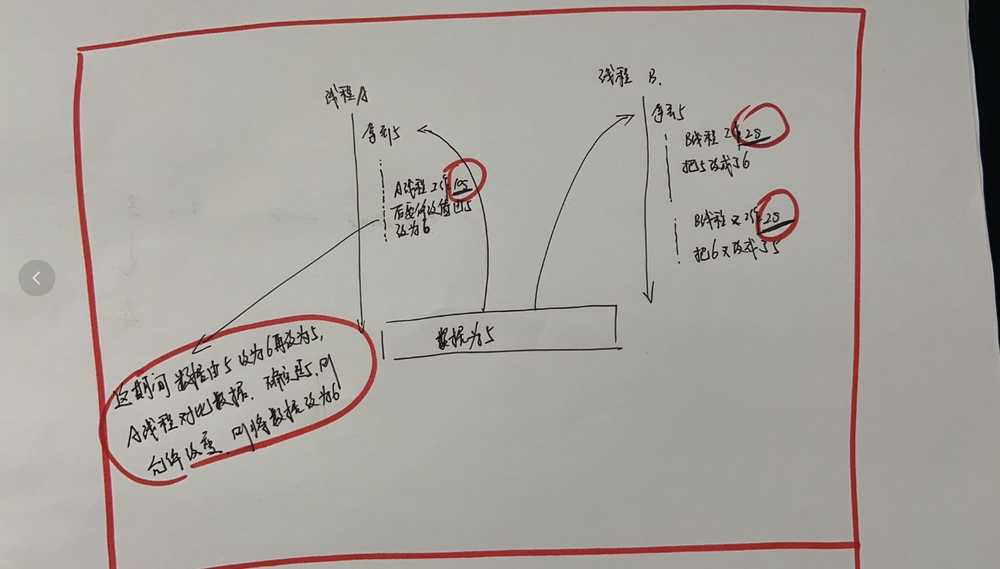

## CAS的ABA问题及解决


#### 一、CAS的ABA问题产生原因

CAS能运行的前提是，需要操作的共享变量的当前值与线程提供的期望值相同，就认为变量没有被其它线程修改过！而实际上这个假设并不成立！


#### 二、CAS的ABA问题图解




#### 三、ABA问题的复现

准备线程操作的资源类

```java
public class LockResouce {

    private String a = "a";

    public AtomicReference<String> atomicString = new AtomicReference<>(a);

    public void changeToB(){

        atomicString.compareAndSet(a, "b");
        System.out.println(Thread.currentThread().getName() + "设置成功" +atomicString.get());
    }

    public void changeToA(){
        atomicString.compareAndSet("b", "a");
        System.out.println(Thread.currentThread().getName() + "设置成功" +atomicString.get());
    }


}
```

准备操作资源类的两个线程

```java
public static void main(String[] args) throws InterruptedException {

  LockResouce lockResouce = new LockResouce();

  Thread t1 = new Thread(()->{

    try {
      Thread.sleep(10000L);

      lockResouce.changeToB();
    } catch (InterruptedException e) {
      throw new RuntimeException(e);
    }

  }, "A");
  t1.start();

  Thread t2 = new Thread(()->{
    lockResouce.changeToB();

    try {
      Thread.sleep(2000L);
    } catch (InterruptedException e) {
      throw new RuntimeException(e);
    }

    lockResouce.changeToA();

  }, "B");
  t2.start();
}
```

问题描述：线程A要把变量a的值改为b，但是线程A的业务执行比较耗时，在线程A执行业务期间，线程B在极短的时间内把变量a的值从a改成了b，又从b改成了a，那么线程A，这个时候是没有感知到变量a的值已经改过了的，还是会继续处理，把变量a的值改为b。这样有可能会带来问题。


