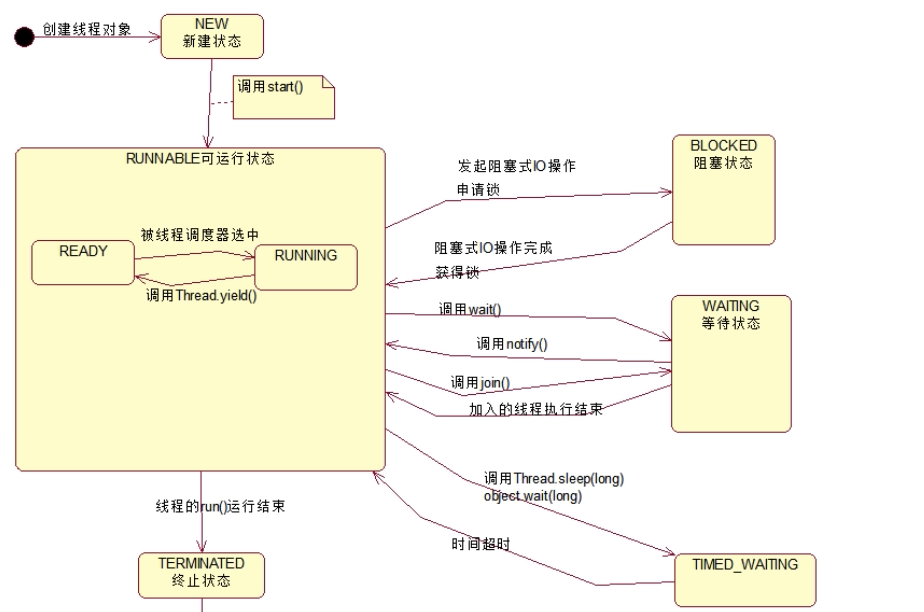

## 线程的几种状态

在Thread类中有一个state的枚举，定义好了线程的状态，如下：

1. NEW状态，即新建状态，创建了线程对象，在调用start()方法启动线程之前的状态。
2. RUNNABLE状态，它是一个符合状态，它包括READY和RUNNING状态，READY状态表示该线程可以被线程调度器进行调度，线程一旦被调度器调度了线程就会变为RUNNING状态。RUNNING状态表示该线程正在执行（正在执行线程的run()方法）。Thread.yield()方法可以把线程由RUNNING状态变为READY状态。
3. BLOCKED状态，线程发起一个阻塞的IO操作，或者申请由其它线程占用的独占资源（锁），线程就会进入BLOCKED状态。处于BLOCKED状态的线程不会占用CPU，当阻塞IO执行完或者获取到了其它线程占用到的资源，会从BLOCKED状态进入RUNNABLE状态。
4. WAITING状态，当使用wait()等方法挂起一个线程，线程的状态会变为WAITING状态。当调用notify()等等方法唤醒线程的时候，线程会从WAITING状态变为RUNNABLE状态。
5. TIMED_WAITING状态，跟WAITING状态类似，不过WAITING状态是死等，而处于TIMED_WAITING状态的线程不会无限等待，如果线程在指定的时间内没有完成期望的操作，会自动变为RUNNABLE状态。
6. TERMINATED状态，线程结束状态

