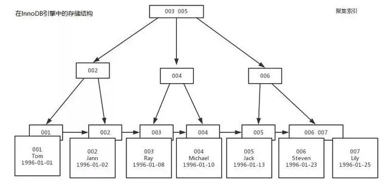
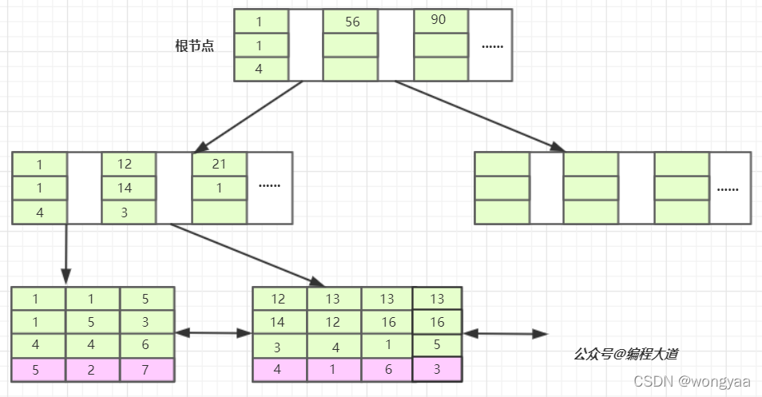
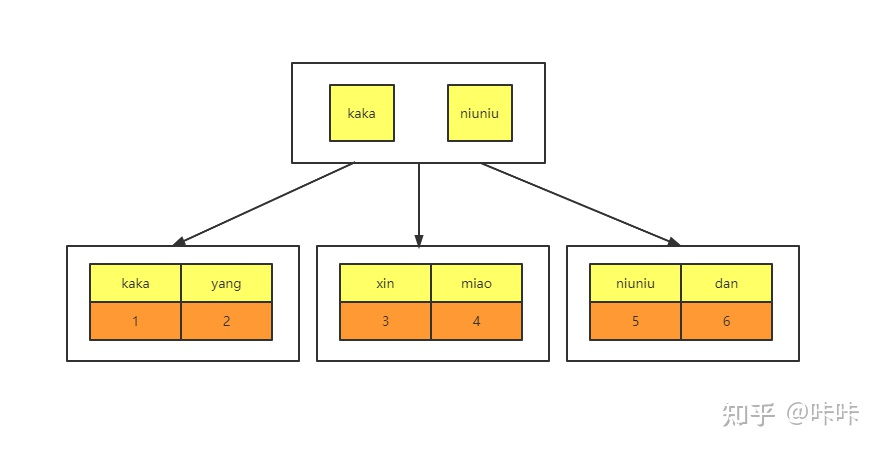

## 索引数据使用B+tree如何存储

> 每个叶子节点就是数据页

#### 1、聚簇索引

每个内部节点存储这主键值。

每个叶子节点，不仅存储主键的数据，也存储这表中其它字段的数据。

#### 2、非聚簇索引

- 组合索引

  

  每个内部节点存储这个组合索引每个字段的值，以组合索引第一个字段构建B+tree，然后在第一个字段相同的情况下，对第二个字段排序。在第二个字段相同的情况下，对第三个字段排序。

  每个叶子节点，存储着组合索引的每个字段的值和对应数据的id值。

- 其它索引

  

  每个内部节点存储这个索引的字段值。

  每个叶子节点，存储这索引的字段值和对应数据的id值。

  