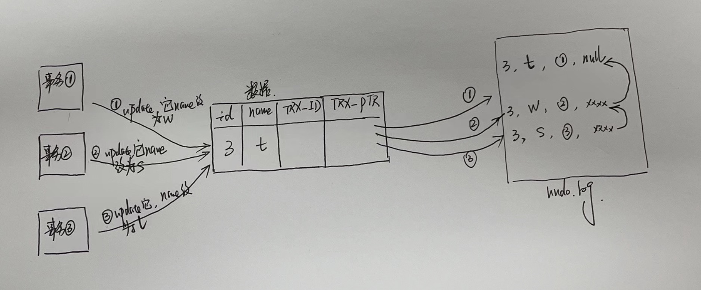
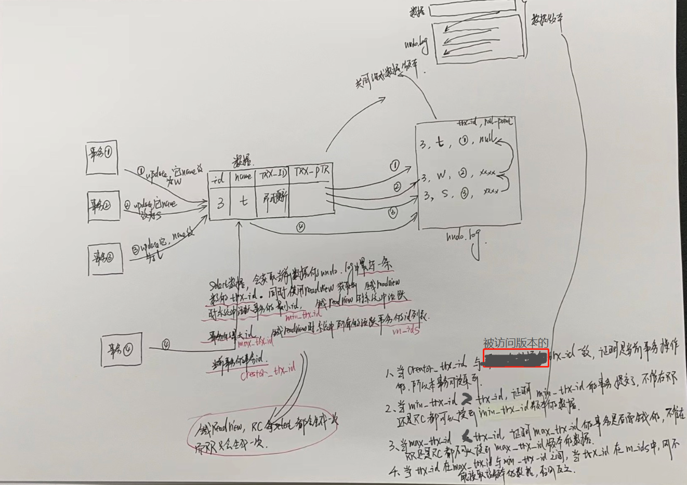
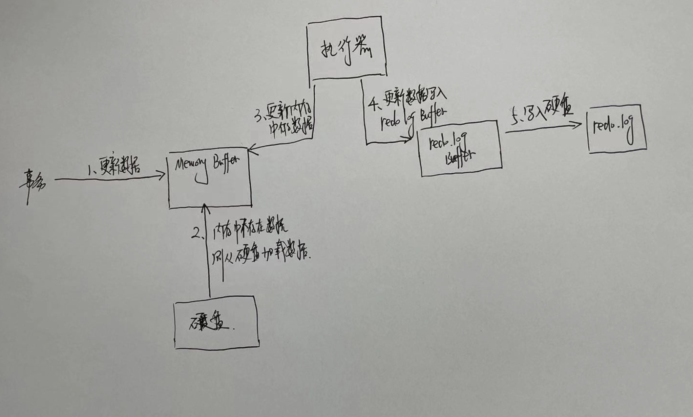

## 日志的种类

#### 1、undo.log

- 概念：

  事务的回滚日志，在事务中当我们一执行insert、update、delete语句（不用等待commit），会对应生成一条镜像语句存放在undo.log中。

  insert语句，在事务提交的时候，undo.log中的记录就直接被删除了（因为只用做回滚，但事务已经提交了，所以可以直接删除），

  update、delete语句，在事务提交的时候，undo.log中的记录不能直接被删除，因为在多版本控制中需要被进行快照读，想想，共享式读锁！

- 存储结构

  同一个事务或不同的事务，修改了同一条数据，会导致这一条数据在undo.log中形成一条单向链表，链表的头部是最新的记录，链表的尾部是最老的记录。表中的数据会有2个隐藏的字段，记录当前最新的事务ID号和指向undo.log中链表的头部。

  

- undo.log数据产生全过程

  

  原始数据为id=3，name=t。

  事务①将其修改为name=w，那么undo.log中会记录一条数据id=3，name=t，TRX_ID=①，ROLL_POINT = NULL

  事务②将其修改为name=s，那么undo.log中会记录一条数据id=3，name=w，TRX_ID=②，ROLL_POINT = 指向上面一层数据
  事务③将其修改为name=l，那么undo.log中会记录一条数据id=3，name=s，TRX_ID=③，ROLL_POINT = 指向上面一层数据

  undo.log中针对用一个数据的修改是以一条单向链表的方式存储。

  

- MVCC（多版本并发控制）配合undo.log做并发读取

  

  图中，max_trx_id > trx_id 需要改为 max_trx_id >= trx_id

  注意：

  1. select语句也会分配事务id，但不会记录到数据的隐藏字段trx_pid中。
  1. 事务begin不会分配事务ID，只有执行第一条语句才会分配事务id
  2. 同一事务中2次update操作就有2个事务ID
  3. min_trx_id=当前系统中活跃的读写事务中最小的事务id
  4. max_trx_id = 整个mysql系统分配的当前已经分配到的最大事务id + 1
  5. 在RR模式下两次select连续在一起不会重复生成readview，只会用第一个语句生成的readview。但是两次select中间有一次update操作，第二次select就会重新生成readview。而RC模式下，每次select都会生成readview。

#### 2、redo.log

- 概念

  数据库的重做日志，是事务持久性的重要保证。

- 为什么要使用redo.log

  因为，当我们在事务中，去修改一条数据的时候，mysql会将带有这条数据的数据页(16K)全部加载到内存中，修改好这条数据，如果将这16K的一页数据一次性写回去，太浪费了。而如果不写到硬盘中去，此时修改的数据又在内存中，万一出现问题，数据没法恢复就丢失了，权衡利弊，就使用了redo.log，把修改的记录放到redo.log中。即使系统崩溃了，也可以恢复。

- redo.log的刷盘机制

  redo.log的数据一开始也是写在内存中的，那么具体什么时候刷盘到硬盘中呢？通过一个参数控制：innodb_flush_log_at_trx_commit，值为1表示commit的时候进行刷盘：这也是最保险的，因为如果这个时候崩溃了代表没有commit成功，因此，也不用恢复什么数据。值为2表示commit的时候，只是刷新进os的内核缓冲区，具体的刷盘时机不确定。

  值为0表示后台线程，每s刷新一次到磁盘中。推荐使用值为1的方案。

- 整体流程图解

  

#### 3、bin.log

最重要的日志，它记录了所有的DDL和DML语句（除了数据查询语句select）,以事件形式记录，还包含语句所执行的消耗的时间，MySQL的二进制日志是事务安全型的。

一般都是DBA去操作，这块咱们不用管。

#### 4、慢查询日志

参考：https://blog.csdn.net/sebeefe/article/details/126081113

