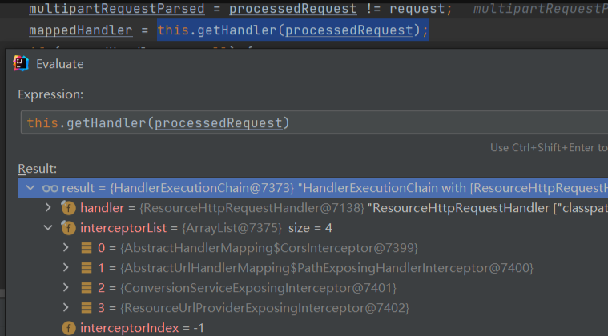
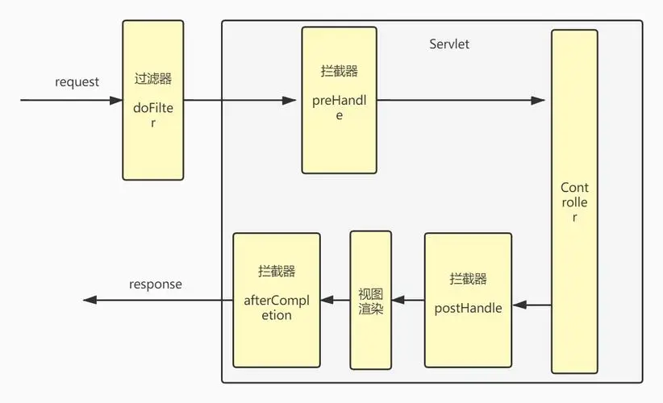

## springboot拦截器源码分析

#### 一、自己实现拦截器

1. 编写拦截器

   ```java
   @Component
   public class LoginInterceptor implements HandlerInterceptor {
       @Override
       public boolean preHandle(HttpServletRequest request, HttpServletResponse response, Object handler) throws Exception { //执行标的方法之前执行
           return true;
       }
   
       @Override
       public void postHandle(HttpServletRequest request, HttpServletResponse response, Object handler, ModelAndView modelAndView) throws Exception { //执行标的方法之后执行
   
       }
   }
   ```

   

2. 注册拦截器

   ```java
   @Configuration
   public class WebInterceptorConfig implements WebMvcConfigurer {
   
       @Autowired
       public LoginInterceptor loginInterceptor; //上面的拦截器加载进来
   
       @Override
       public void addInterceptors(InterceptorRegistry registry) {
   //        registry.addInterceptor(loginInterceptor).addPathPatterns("/**").excludePathPatterns(new String[]{"/login", "/logout"});
       }
   }
   ```

   


#### 二、拦截器源码分析

我们回到`springboot请求处理源码分析`一文的`doDispatch方法中`，代码如下

```java
protected void doDispatch(HttpServletRequest request, HttpServletResponse response) throws Exception {
  // 封装一下Request请求
  HttpServletRequest processedRequest = request;
  // 初始化HandlerExecutionChain
  HandlerExecutionChain mappedHandler = null;
  boolean multipartRequestParsed = false;

  WebAsyncManager asyncManager = WebAsyncUtils.getAsyncManager(request);

  try {
    ModelAndView mv = null;
    Exception dispatchException = null;

    try {
      // 检查是否文件上传
      processedRequest = checkMultipart(request);
      multipartRequestParsed = (processedRequest != request);
      // 寻找到Request对应哪一个Hander（controller）方法
      mappedHandler = getHandler(processedRequest);
      if (mappedHandler == null) {
        noHandlerFound(processedRequest, response);
        return;
      }

      // Determine handler adapter for the current request.
      HandlerAdapter ha = getHandlerAdapter(mappedHandler.getHandler());

      // Process last-modified header, if supported by the handler.
      String method = request.getMethod();
      boolean isGet = "GET".equals(method);
      if (isGet || "HEAD".equals(method)) {
        long lastModified = ha.getLastModified(request, mappedHandler.getHandler());
        if (new ServletWebRequest(request, response).checkNotModified(lastModified) && isGet) {
          return;
        }
      }

      if (!mappedHandler.applyPreHandle(processedRequest, response)) {
        return;
      }

      // Actually invoke the handler.
      mv = ha.handle(processedRequest, response, mappedHandler.getHandler());

      if (asyncManager.isConcurrentHandlingStarted()) {
        return;
      }

      applyDefaultViewName(processedRequest, mv);
      mappedHandler.applyPostHandle(processedRequest, response, mv);
    }
    catch (Exception ex) {
      dispatchException = ex;
    }
    catch (Throwable err) {
      // As of 4.3, we're processing Errors thrown from handler methods as well,
      // making them available for @ExceptionHandler methods and other scenarios.
      dispatchException = new NestedServletException("Handler dispatch failed", err);
    }
    processDispatchResult(processedRequest, response, mappedHandler, mv, dispatchException);
  }
  catch (Exception ex) {
    triggerAfterCompletion(processedRequest, response, mappedHandler, ex);
  }
  catch (Throwable err) {
    triggerAfterCompletion(processedRequest, response, mappedHandler,
                           new NestedServletException("Handler processing failed", err));
  }
  finally {
    if (asyncManager.isConcurrentHandlingStarted()) {
      // Instead of postHandle and afterCompletion
      if (mappedHandler != null) {
        mappedHandler.applyAfterConcurrentHandlingStarted(processedRequest, response);
      }
    }
    else {
      // Clean up any resources used by a multipart request.
      if (multipartRequestParsed) {
        cleanupMultipart(processedRequest);
      }
    }
  }
}

```

其中的`getHandler`方法，得到处理器（可以处理请求的handler以及handler的所有拦截器）



随后，在执行目标方法之前，执行所有拦截器


applyPreHandle的具体实现，如下


顺序执行interceptorList中的拦截器的preHandle方法，如果preHandle返回为**false**则执行**triggerAfterCompletion**方法，**倒序执行**（i-- 的for循环方式）并返回false。

如果任何一个拦截器返回了false，直接不执行目标方法。

所有拦截器都返回 true，执行目标方法。


目标方法执行完毕，执行所有拦截器的postHandle方法


使用倒叙的方式执行所有拦截器的postHandle方法


拦截器总结图

