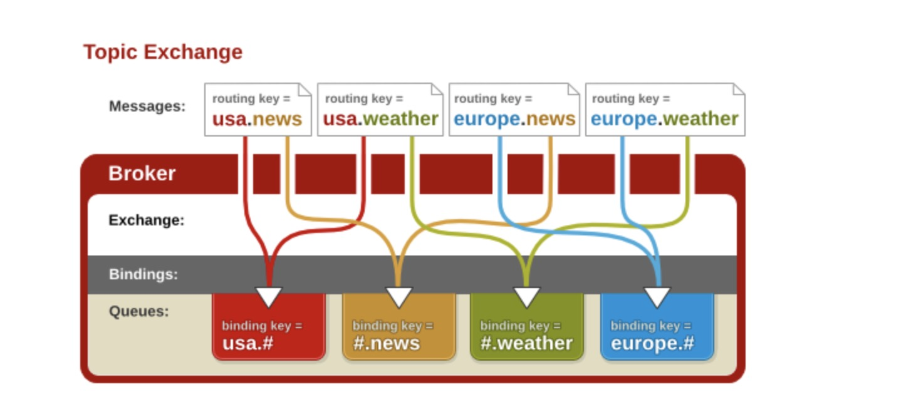

## 交换机的类型

交换机的类型，是我们在新增交换机的时候指定的交换机`Type`字段，如下图

#### 1、fanout类型

该类型的交换机，当消息到达该交换机的时候，根本不看具体消息的Routing Key和所有Binding的Routing Key，而是直接将消息广播到Binding的Queue中。

这样，一条消息会被放到多个Queue中从而被多个Consumer消费！

#### 2、direct类型

该类型的交换机，当消息到达该交换机的时候，会对具体消息的Routing Key和所有Binding的Routing Key，进行严格的一一比对，只有两者的Routing Key完全相同才会把消息转到对应的Queue。

#### 3、topic类型

该类型的交换机，当消息到达该交换机的时候，会对具体消息的Routing Key和所有Binding的Routing Key，进行逐个的模糊匹配（因为Exchange与Queue绑定的时候，Routing Key是可以写表达式的！），只要符合绑定的Routing Key的表达式规则，则消息就会往对应的Queue中放一份！

这样，一条消息会被放到多个Queue中从而被多个Consumer消费！

Routing Key表达式中的`#`代表匹配多个任意词。

Routing Key表达式中的`*`代表匹配一个任意词。