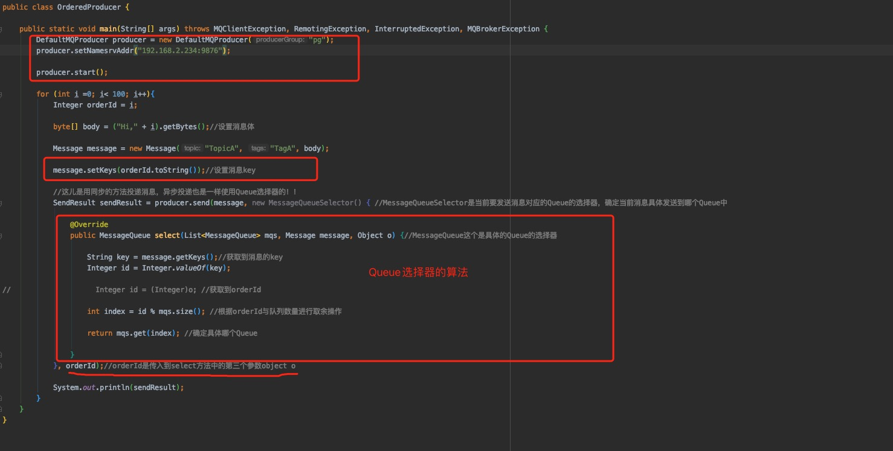

## Message之顺序消息的顺序性如何保证？


#### 什么是Message的顺序性

顺序消息是一种对消息发送和消费顺序有严格要求的消息。消息严格按照先进先出（FIFO）的原则进行消息发布和消费，即先发布的消息先消费，后发布的消息后消费。只有同时满足了生产顺序性和消费顺序性才能达到上述的FIFO效果。


#### 消息顺序性分类

RocketMQ能严格保证消息的有序性，将顺序消息分为全局顺序消息与分区顺序消息。

- 全局顺序：一个 Topic有且只有一个Queue，所有消息都被按有序的存放到一个Queue中，消费者有序的消费queue上的消息。

- 分区顺序：一个 Topic有多个Queue，仅可以保证存储到同一个Queue上的消息的顺序性，不同Queue间的消息无法保证顺序性，消费的时候也只能保证同一个Queue的消息的顺序性！

  


#### 顺序消息在Producer端如何保证？

1. Producer端在发送消息的时候，使用同步发送消息的方式先发送一条消息，只有接收到了Broker Server的ack消息之后，才会发送下一条消息，所以发送的时候肯定是有序发送的

2. Producer端在发送消息的时候，把需要发送到同一个Queue上的消息在发送的时候做好

   


#### 顺序消息在Broker Server端如何保证？

只要生产者发送过来的消息是有序的，Broker按照生产者发送过来的消息保存起来就保证消息在Broker服务器的有序性！


#### 顺序消息在Consumer端如何保证？

- pull模式：用户控制线程，主动从服务端获取消息，每次获取到的是一个MessageQueue中的消息。PullResult中的List和存储顺序一致，只需要自己保证消费的顺序。

- push模式：用户注册MessageListener来消费消息，在客户端中需要保证调用MessageListener时消息的顺序性，不要使用并发消费的模式！

  ```java
  @GetMapping("/index2")
      public void index2() throws MQClientException {
  
          DefaultMQPushConsumer consumer = new DefaultMQPushConsumer("cpg");
          consumer.setNamesrvAddr("10.10.210.24:9876;10.10.210.24:9877");
          consumer.subscribe("t4", "*");//订阅消费的Topic和tag
          consumer.setPullBatchSize(50); //设置一次拉取最多多少条消息，实际拉取可能不到这个数值
          consumer.setMessageModel(MessageModel.CLUSTERING);
  
          consumer.registerMessageListener(new MessageListenerOrderly() { //设置消费模式为顺序消费模式，我们之前都是使用 MessageListenerConcurrently 并发消费的！
              @Override
              public ConsumeOrderlyStatus consumeMessage(List<MessageExt> list, ConsumeOrderlyContext consumeOrderlyContext) {
  
                  System.out.println(list);
  
                  return ConsumeOrderlyStatus.SUCCESS;
              }
          });
  
  
          consumer.start();
          
      }
  ```

  