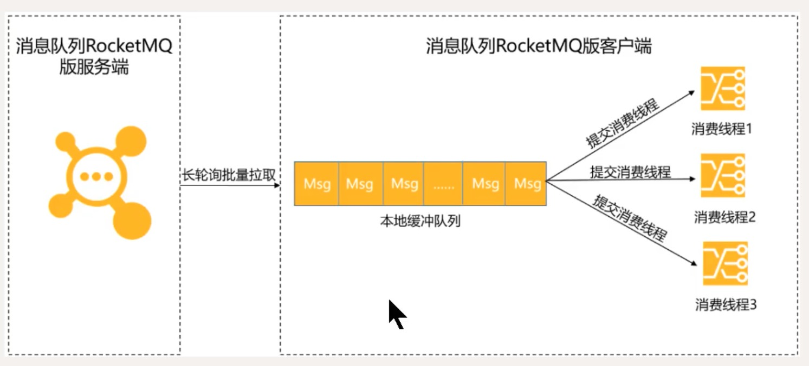

## Consumer消费速度跟不上导致消息堆积与消费延迟及问题解决


#### 消息堆积与消费延迟概念

消息处理过程中，如果Consumer的消费速度跟不上Producer的发送速度，MQ中未处理的消息会越来越多(进的多出的少)，这部分消息就被称为堆积消息。

消息出现堆积进而会造成消息的消费延迟。**对实时性要求高的业务系统中，绝对不能出现消费延时！**


#### 消息堆积原因分析



消息拉取阶段：Consumer通过长轮询pull模式批量的方式从服务端获取消息，将拉取到的消息缓存到本地缓冲队列中。对于拉取式消费，这个阶段不会成为瓶颈。

消息消费阶段：Consumer将本地缓存的消息提交到消费线程中，使用业务消费逻辑对消息进行处理，处理完毕后获取到一个结果，这是真正的消息消费过程。此时Consumer的消费能力完全依赖于消息的**消费耗时**和**消费并发度**了。如果由于业务处理逻辑复杂等原因，导致单条消息的耗时较长，则整体的消息吞吐量肯定不会高，此时就**会导致Consumer本地缓冲队列到达上限，停止从服务端拉取消息**。


#### 如何解决消息堆积与消费延迟的问题

1. 如果单个线程处理时间过程，那么先优化线程逻辑处理代码

2. 增加consumer的数量

3. 增加consumer的线程数量

   ```java
   consumer.setConsumeThreadMin();//设置最小线程数，默认为20
   consumer.setConsumeThreadMax(); //设置最大线程数，默认为64
   ```