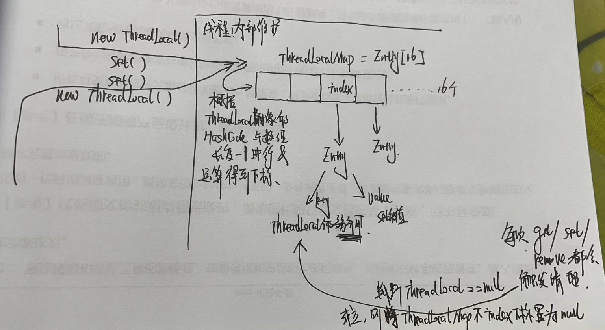

## ThreadLocal源码分析


#### 1、原理分析

最终的原理图：



每个线程在调用ThreadLocal的set方法后，都会在线程内部维护一个ThreadLocalMap的数组Entry[]，每个ThreadLocal都会被封装成Entry装到这个数据中，具体是如何计算数组下标的，根据ThreadLocal对象的HashCode与数组长度-1的数值进行“&”运算，得到下标。其中注意，ThreadLocal被装到Entry对象中的key上，是装的ThreadLocal的弱引用！


#### 2、set()方法分析

```java
public void set(T value) {
  Thread t = Thread.currentThread(); //获取到当前线程
  ThreadLocalMap map = getMap(t); //获取到当前线程的 ThreadLocal.ThreadLocalMap threadLocals属性，默认为null
  if (map != null) {
    map.set(this, value);
  } else {
    createMap(t, value); //判断map为null，则调用createMap()方法
  }
}

ThreadLocalMap getMap(Thread t) {
  return t.threadLocals;
}

void createMap(Thread t, T firstValue) {
  t.threadLocals = new ThreadLocalMap(this, firstValue);
}
```

代码很简单，获取当前线程，并获取当前线程的ThreadLocalMap实例（从getMap(Thread t)中很容易看出来）。如果获取到的map实例不为空，调用map.set()方法，否则调用构造函数 new ThreadLocalMap(this, firstValue)实例化map。

下面来看看具体的ThreadLocalMap的类的构造方法：

```java
ThreadLocalMap(ThreadLocal<?> firstKey, Object firstValue) {
  table = new Entry[INITIAL_CAPACITY]; //table属性默认为Entry[]（Entry的数组），这儿初始化table为长度16的Entry数组。
  int i = firstKey.threadLocalHashCode & (INITIAL_CAPACITY - 1); //计算索引
  table[i] = new Entry(firstKey, firstValue); //初始化一个Entry并设置到table中
  size = 1;
  setThreshold(INITIAL_CAPACITY);//设置阈值
}
```

我们再回到开头的方法中

```java
public void set(T value) {
  Thread t = Thread.currentThread(); //获取到当前线程
  ThreadLocalMap map = getMap(t); //获取到当前线程的 ThreadLocal.ThreadLocalMap threadLocals属性，默认为null
  if (map != null) {
    map.set(this, value);
  } else {
    createMap(t, value); //判断map为null，则调用createMap()方法
  }
}
```

看`map.set(this, value)`具体的实现

```java
private void set(ThreadLocal<?> key, Object value) {

  Entry[] tab = table;
  int len = tab.length;
  //计算索引
  int i = key.threadLocalHashCode & (len-1);

  
  //同一个threadLocal计算得到的索引应该是一个，所以根据索引得到的Entry如果不为null，就会去对比key是否一致。
  //如果执行for的内部代码，没有return，证明是hash冲突了！就使用nextIndex()获取下一个。
  for (Entry e = tab[i];
       e != null;
       e = tab[i = nextIndex(i, len)]) {// 退出循环 e==null
    if (e.refersTo(key)) { //对比当前的Entry的ThreadLocal的引用 与 参数key的ThreadLocal的引用是否一致，说直白点，就是Entry的key与参数key是否一致，如果一致就把Entry中的value直接改掉
      e.value = value;
      return; //退出循环靠return
    }

    if (e.refersTo(null)) {// 对比当前的Entry的ThreadLocal的引用 如果为null，说明被回收了
      replaceStaleEntry(key, value, i);
      return; //退出循环靠return
    }
  }

  //找到为空的插入位置，插入值，在为空的位置插入需要对size进行加1操作
  tab[i] = new Entry(key, value);
  int sz = ++size;
  
  //cleanSomeSlots用于清除那些e.get()==null，也就是table[index] != null && table[index].get()==null（table[index].get()是获取ThreadLocal对象的引用的）所以这个Entry(table[index])可以被置null。如果没有清除任何entry,并且当前使用量达到了负载因子所定义(长度的2/3)，那么进行rehash()
  if (!cleanSomeSlots(i, sz) && sz >= threshold)
    rehash();
}


private boolean cleanSomeSlots(int i, int n) {
  boolean removed = false;
  Entry[] tab = table;
  int len = tab.length;
  do {
    i = nextIndex(i, len);
    Entry e = tab[i];
    if (e != null && e.refersTo(null)) {
      n = len;
      removed = true;
      i = expungeStaleEntry(i);
    }
  } while ( (n >>>= 1) != 0);
  return removed;
}
```


#### 3、get()、remove()方法自己网上找吧

