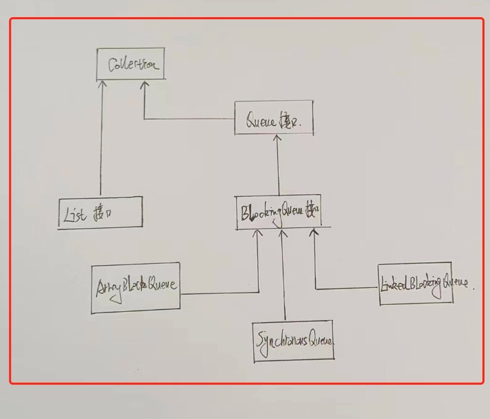

## 阻塞队列BlockingQueue


#### 什么是BlockingQueue

java本地维持一个可用的<font color="red">先进先出</font>的队列。


#### 使用案例

在线程池中，第5个参数就是一个阻塞队列。


#### 类架构图解




#### ArrayBlockingQueue、LinkedBlockingQueue使用

> 两个队列使用方法一致，下面以ArrayBlockingQueue为例


- 抛出异常：当队列没有数据去取、队列满了还往里面放、查询一个不存在的数据，就直接抛异常

  方法为：add、remove、element

  ```java
  ArrayBlockingQueue arrayBlockingQueue = new ArrayBlockingQueue<>(3); //初始化队列大小为3
  arrayBlockingQueue.add(1);
  arrayBlockingQueue.add(2);
  arrayBlockingQueue.add(3);
  
  arrayBlockingQueue.add(4);//因为已经往队列中塞了1、2、3这3个数据了，再往里面塞就会抛出队列满了的异常
  
  System.out.println(arrayBlockingQueue.remove());
  System.out.println(arrayBlockingQueue.remove());
  System.out.println(arrayBlockingQueue.remove());
  
  System.out.println(arrayBlockingQueue.remove());//因为已经从队列中取出了1、2、3这3个数据了，再从队列中取数据就会抛出队列空了的异常
  
  arrayBlockingQueue.element(); //因为已经从队列中取出了1、2、3这3个数据了，再来查询有没有数据，就会抛出队列空了的异常
  ```

- 返回true/false：对队列的操作成功返回true、失败（队列满了还放，队列空了还取）返回false或者null

  方法为：offer、poll、peek

  ```java
  ArrayBlockingQueue arrayBlockingQueue = new ArrayBlockingQueue<>(3);//初始化队列大小为3
  System.out.println(arrayBlockingQueue.offer(1));
  System.out.println(arrayBlockingQueue.offer(2));
  System.out.println(arrayBlockingQueue.offer(3));
  
  System.out.println(arrayBlockingQueue.offer(4));//因为已经往队列中塞了1、2、3这3个数据了，再往里面塞就会返回false
  
  System.out.println(arrayBlockingQueue.poll());
  System.out.println(arrayBlockingQueue.poll());
  System.out.println(arrayBlockingQueue.poll());
  
  System.out.println(arrayBlockingQueue.poll());//因为已经从队列中取出了1、2、3这3个数据了，再从队列中取数据就会返回false
  
  System.out.println(arrayBlockingQueue.peek());//因为已经从队列中取出了1、2、3这3个数据了，再来查询有没有数据，就会返回false
  ```

- 无限阻塞：队列中满了还往里面放，阻塞。队列中空了还从里面取阻塞。

  方法为：put、take

  ```java
  ArrayBlockingQueue arrayBlockingQueue = new ArrayBlockingQueue<>(3);//初始化队列大小为3
  arrayBlockingQueue.put(1);
  arrayBlockingQueue.put(2);
  arrayBlockingQueue.put(3);
  
  arrayBlockingQueue.put(4);//因为队里大小为3，当代码走到这儿，就会触发阻塞等待
  
  System.out.println(arrayBlockingQueue.take());
  System.out.println(arrayBlockingQueue.take());
  System.out.println(arrayBlockingQueue.take());
  
  System.out.println(arrayBlockingQueue.take());//因为队里大小为3，当代码走到这儿，就会触发阻塞等待
  ```

- 阻塞等待超时：队列中满了还往里面放，阻塞等待超时。队列中空了还从里面取，阻塞等待超时。

  方法为：offer、poll

  ```java
  ArrayBlockingQueue arrayBlockingQueue = new ArrayBlockingQueue<>(3);//初始化队列大小为3
  arrayBlockingQueue.offer(1, 2, TimeUnit.SECONDS);
  arrayBlockingQueue.offer(2, 2, TimeUnit.SECONDS);
  arrayBlockingQueue.offer(3, 2, TimeUnit.SECONDS);
  
  
  arrayBlockingQueue.offer(4, 2, TimeUnit.SECONDS);//因为队里大小为3，当代码走到这儿，就会触发阻塞等待2S
  
  System.out.println(arrayBlockingQueue.poll(2, TimeUnit.SECONDS));
  System.out.println(arrayBlockingQueue.poll(2, TimeUnit.SECONDS));
  System.out.println(arrayBlockingQueue.poll(2, TimeUnit.SECONDS));
  
  arrayBlockingQueue.poll(2, TimeUnit.SECONDS);//因为队里大小为3，当代码走到这儿，就会触发阻塞等待2S
  
  ```

  

