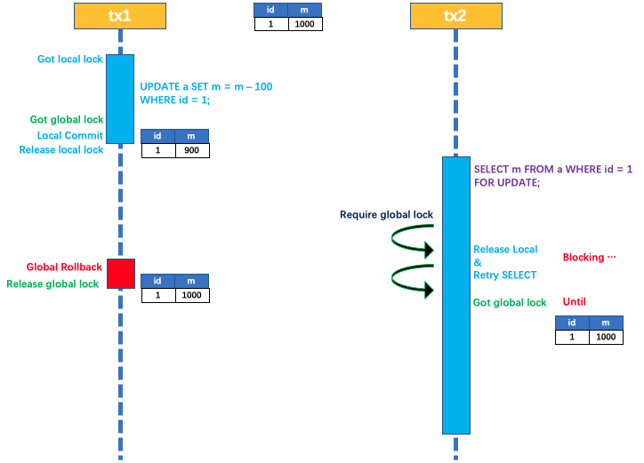

## AT模式中的重要概念

#### 一、全局锁：

加了@GlobalTransactional的地方会根据要处理的行生成全局锁（有多少行就有多少个全局锁），好比在mysql中给一行数据加锁。

#### 二、全局锁的释放：

只有当全局事务处理完毕（包括父子事务），全局锁才能释放，好比mysql中事务处理完毕，行锁释放。

#### 三、如果2个全局事务，在同时更新一条数据，怎么保证写隔离的？

- 二阶段是全局提交：

  

- 二阶段是全局回滚（tx1 需要重新获取该数据的本地锁，进行反向补偿的更新操作，实现分支的回滚。此时，如果 tx2 仍在等待该数据的全局锁，同时持有本地锁，则 tx1的分支回滚会失败。分支的回滚会一直重试，直到 tx2 的 全局锁等锁超时，放弃全局锁并回滚本地事务释放本地锁，tx1 的分支回滚最终成功。因为整个过程 全局锁 在 tx1 结束前一直是被 tx1 持有的，所以不会发生 脏写 的问题。）：

  

- 如果2个全局事务，一个更新数据，一个读取数据，怎么保证写隔离？

  