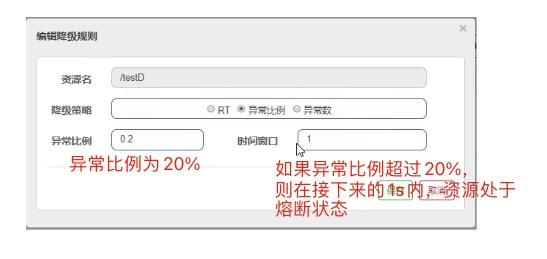
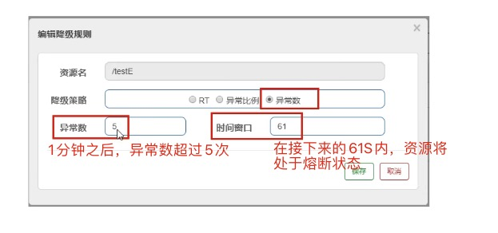
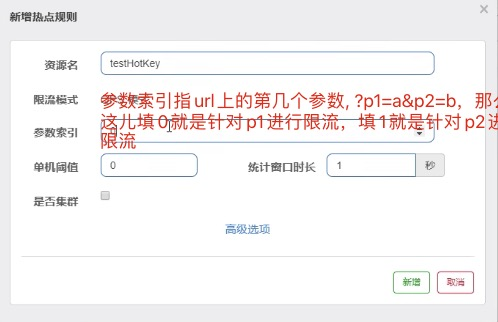
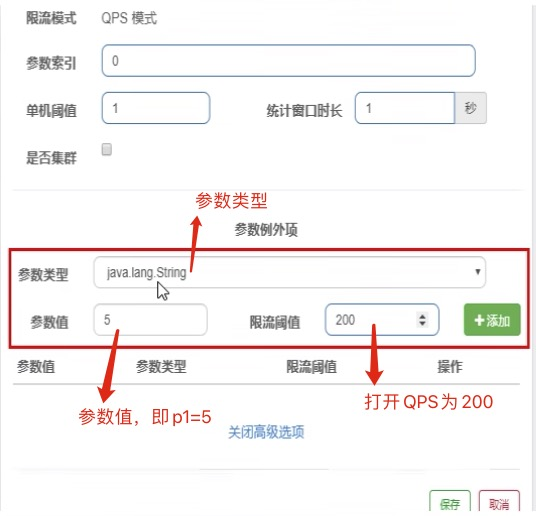

## Sentinel Dashboard使用中的一些概念

1. 在web项目中，Controller的每一个方法入口都是一个resource，该resource会存放在默认名为sentinel_spring_web_context的context下。

2. 流控QPS直接失败：限制资源并发量，超过限制直接执行BlockExceptionHandler。

3. 流程线程数直接失败：限制资源访问的线程数，超过线程数量直接执行BlockExceptionHandler。

4. 流控关联：A资源关联B资源，当被关联资源B流控达到阈值之后，A资源会限流自己。

5. 流控预热（Warm Up）：对资源A，选择的限流方式为QPS阈值为10，预热时长为5，选择Warm Up的效果，那么资源A运行之后，QPS的阈值是10/3 = 3的，这儿被除的3是sentinel中内置的，5秒之后QPS的阈值才会达到10。【抢购的时候可以使用】

6. 熔断降级概念：当资源调用的链路中出现了资源不稳定的情况(调用超时或异常比例升高)，对这个不稳定的资源调用会进行降级让其快速失败，避免影响到其它资源而导致联级错误。当不稳定的资源被降级后，在接下来的降级时间窗口内，对该资源的访问都会自动熔断（抛出DegradeException）

7. RT：当1秒内持续进入一批（超过5个）请求且对应的这批请求的平均响应时间(秒级)都超过阈值(毫秒)，那么就会触发该资源的熔断。

   

8. 异常比例：当1秒内持续进入一批（超过5个）请求且对应的这批请求的异常比例超过阈值，那么就会触发该资源的熔断。

   

9. 异常数：当资源近1分钟的异常数目超过阈值，那么就会触发该资源的熔断。

   

10. 热点参数限流(只能QPS)：对同一个URL，http://localhost:8080/getUser?p1=a和http://localhost:8080/getUser?p1=a&p2=b，地址是一样的，只是get参数不同。

    

    经过上面的配置，第一个参数就已经固定是p1了，如果把p1参数删掉变成http://localhost:8080/getUser?p2=b，那么这儿配置的流控规则是不会生效的！

    热点限流规则一般配合@SentinelResource的方式使用，因为需要使用BlockHandler的兜底方法。

    扩展配置：

    ​		上面配置了针对p1的限制，无论p1的值为多少，单机阈值(QPS)都是固定的，那么如果我需要在p1为某个特殊值的时候QPS稍稍放开一些，咋处理？

    

11. 系统规则：上面的配置，只针对某个资源进行自己配置限流，而系统规则呢，是站在应用整体的层面进行限流！

    一般不用的！