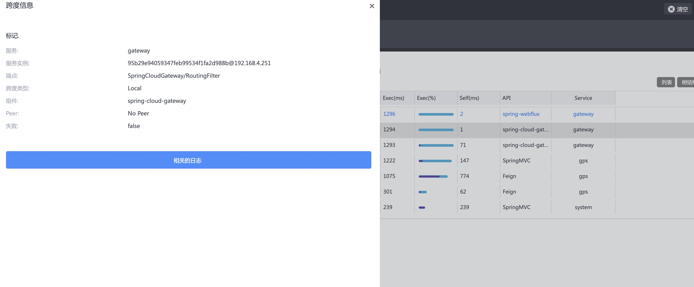
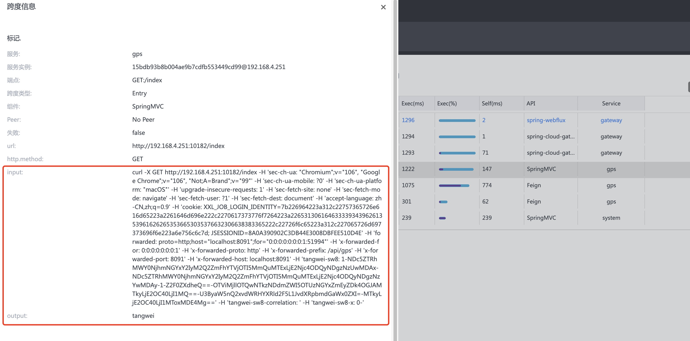

## 增强链路上的跨度数据

> 哪个微服务要用了，就加在哪个微服务里，不要用的不加

需求是这样的，配置好了skywalking-server并且集成好了skywalking-agent之后，访问相关资源有了对应的链路信息，如下图：



看不到当前请求的入参和出参，这样看到了链路，但是这样真的不太方便，因为我不知道请求参数和具体返回，不知道用户的请求环境是什么样的，所以我需要修改，做成这样。




具体操作步骤：

- 引入依赖

  ```xml
  <!-- https://mvnrepository.com/artifact/org.apache.skywalking/apm-toolkit-trace -->
  <dependency>
    <groupId>org.apache.skywalking</groupId>
    <artifactId>apm-toolkit-trace</artifactId>
    <version>对应你自己的skywalking的版本</version>
  </dependency>
  ```

- 代码编写：

  > 因为HttpServletRequest和HttpServletResponse中的body只能读取一次，如果在Filte中读取的话，应用本身就读取不到，所以需要使用ContentCachingRequestWrapper和ContentCachingResponseWrapper

  ```java
  @Slf4j
  @Component
  public class ApmHttpInfo extends HttpFilter {
      private static final ImmutableSet<String> IGNORED_HEADERS;
      static {
          Set<String> ignoredHeaders = ImmutableSet.of(
                          "Content-Type",
                          "User-Agent",
                          "Accept",
                          "Cache-Control",
                          "Postman-Token",
                          "Host",
                          "Accept-Encoding",
                          "Connection",
                          "Content-Length")
                  .stream()
                  .map(String::toUpperCase)
                  .collect(Collectors.toSet());
          IGNORED_HEADERS = ImmutableSet.copyOf(ignoredHeaders);
      }
  
      @Override
      public void doFilter(HttpServletRequest request, HttpServletResponse response, FilterChain filterChain) throws IOException, ServletException {
          ContentCachingRequestWrapper requestWrapper = new ContentCachingRequestWrapper(request);
          ContentCachingResponseWrapper responseWrapper = new ContentCachingResponseWrapper(response);
  
          try {
              filterChain.doFilter(requestWrapper, responseWrapper);
          } finally {
              try {
                  //构造请求信息: 比如 curl -X GET http://localhost:18080/getPerson?id=1 -H 'token: me-token' -d '{ "name": "hello" }'
                  //构造请求的方法&URL&参数
                  StringBuilder sb = new StringBuilder("curl")
                          .append(" -X ").append(request.getMethod())
                          .append(" ").append(request.getRequestURL().toString());
                  if (StringUtils.hasLength(request.getQueryString())) {
                      sb.append("?").append(request.getQueryString());
                  }
  
                  //构造header
                  Enumeration<String> headerNames = request.getHeaderNames();
                  while (headerNames.hasMoreElements()) {
                      String headerName = headerNames.nextElement();
                      if (!IGNORED_HEADERS.contains(headerName.toUpperCase())) {
                          sb.append(" -H '").append(headerName).append(": ").append(request.getHeader(headerName)).append("'");
                      }
                  }
  
                  //获取body
                  String body = new String(requestWrapper.getContentAsByteArray(), StandardCharsets.UTF_8);
                  if (StringUtils.hasLength(body)) {
                      sb.append(" -d '").append(body).append("'");
                  }
                  //输出到input
                  ActiveSpan.tag("input", sb.toString());
  
                  //获取返回值body
                  String responseBody = new String(responseWrapper.getContentAsByteArray(), StandardCharsets.UTF_8);
                  //输出到output
                  ActiveSpan.tag("output", responseBody);
              } catch (Exception e) {
                  log.warn("fail to build http log", e);
              } finally {
                  //这一行必须添加，否则就一直不返回
                  responseWrapper.copyBodyToResponse();
              }
          }
      }
  }
  ```

  