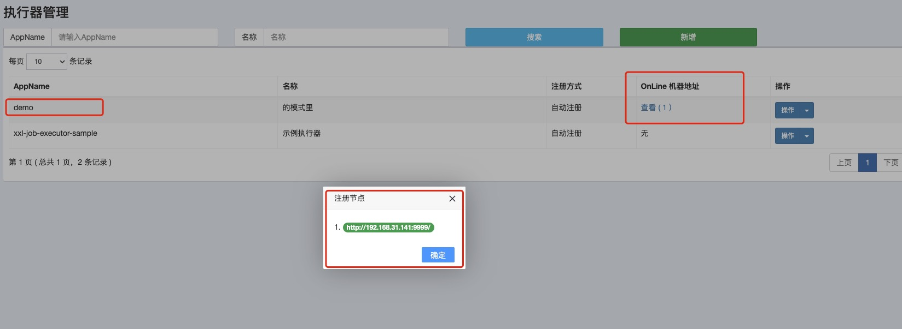

## 客户端集成xxl-job


#### 1、引入依赖

```xml
<!-- https://mvnrepository.com/artifact/com.xuxueli/xxl-job-core -->
<dependency>
    <groupId>com.xuxueli</groupId>
    <artifactId>xxl-job-core</artifactId>
    <version>2.3.0</version>
</dependency>
```


#### 2、完成配置

```yaml
xxl:
  job:
    admin:
      # 调度中心部署跟地址 [选填]：如调度中心集群部署存在多个地址则用逗号分隔。执行器将会使用该地址进行"执行器心跳注册"和"任务结果回调"；为空则关闭自动注册；xxl-job后台管理界面的地址
      addresses: http://192.168.31.215:8080/xxl-job-admin
    executor:
    	# 执行器注册 [选填]：优先使用该配置作为注册地址，为空时使用内嵌服务 ”IP:PORT“ 作为注册地址。从而更灵活的支持容器类型执行器动态IP和动态映射端口问题。
      address:
      # 执行器AppName [选填]：执行器心跳注册分组依据；为空则关闭自动注册
      appname: demo
      # 执行器端口号 [选填]：小于等于0则自动获取；默认端口为9999，单机部署多个执行器时，注意要配置不同执行器端口；
      port: 9999
      # 执行器IP [选填]：默认为空表示自动获取IP，多网卡时可手动设置指定IP，该IP不会绑定Host仅作为通讯实用；地址信息用于 "执行器注册" 和 "调度中心请求并触发任务"；
      ip:
      # 执行器运行日志文件存储磁盘路径 [选填] ：需要对该路径拥有读写权限；为空则使用默认路径；
      logpath: /Users/tangwei/Downloads/loghandler
      # 执行器日志文件保存天数 [选填] ： 过期日志自动清理, 限制值大于等于3时生效; 否则, 如-1, 关闭自动清理功能；
      logretentiondays: 2
    # 执行器通讯TOKEN [选填]：非空时启用；跟调度中心部署时填写的要一致！
    accessToken: zh_CN
```


#### 3、创建一个config让上面的配置生效

> 只有完成这一步，xxl-job的client端才会跟server端通讯

```java
package com.example.demo2.config;

import com.xxl.job.core.executor.impl.XxlJobSpringExecutor;
import lombok.extern.slf4j.Slf4j;
import org.springframework.beans.factory.annotation.Value;
import org.springframework.context.annotation.Bean;
import org.springframework.context.annotation.Configuration;

/**
 * @Auther: tangwei
 * @Date: 2022/9/9 上午9:00
 * @Description: 类描述信息
 */
@Slf4j
@Configuration
public class XxlJobConfig {

    @Value("${xxl.job.admin.addresses}")
    private String adminAddresses;

    @Value("${xxl.job.accessToken}")
    private String accessToken;

    @Value("${xxl.job.executor.address}")
    private String address;

    @Value("${xxl.job.executor.appname}")
    private String appName;

    @Value("${xxl.job.executor.ip}")
    private String ip;

    @Value("${xxl.job.executor.port}")
    private int port;

    @Value("${xxl.job.executor.logpath}")
    private String logPath;

    @Value("${xxl.job.executor.logretentiondays}")
    private int logRetentionDays;


    @Bean
    public XxlJobSpringExecutor xxlJobExecutor() {
        log.info("====xxl-job config init====");
        XxlJobSpringExecutor xxlJobSpringExecutor = new XxlJobSpringExecutor();
        xxlJobSpringExecutor.setAdminAddresses(adminAddresses);
        xxlJobSpringExecutor.setAppname(appName);
        xxlJobSpringExecutor.setIp(ip);
        xxlJobSpringExecutor.setPort(port);
        xxlJobSpringExecutor.setAccessToken(accessToken);
        xxlJobSpringExecutor.setLogPath(logPath);
        xxlJobSpringExecutor.setLogRetentionDays(logRetentionDays);
        return xxlJobSpringExecutor;
    }
}

```

到这儿，启动客户端就可以去后台去看是否成功注册到server端了！




#### 4、到客户端去新增一个任务

```java
@Component  //注意一定要变成一个bean
public class MyXxlJobTest {

    @XxlJob(value = "xxljobtest")
    public void xxljobTest(){
        System.out.println("执行了一次！");
    }

}
```


#### 5、接下来就可以在服务端去配置任务了


#### 6、查看客户端是否正常执行任务

