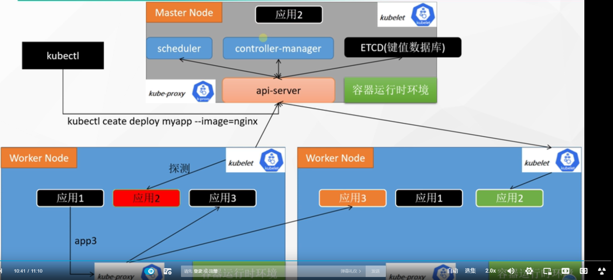

## k8s中各个组件的作用

#### kubelet

是各个master、worker节点的管理员，监控和管理节点上的应用的启动还是关闭。如果应用因为各种原因退出，需要报告给api servier，api server同时 controller manager去重新schduler到新的节点。

#### kube proxy

是各个master、worker节点的网络代理，各个节点的kube proxy是互通数据的，在node1节点中的app1，要访问node1自己、node2中的app2就需要通过kube proxy进行网络代理

#### api server

是负责连接处理请求并转发给 controller manager、schduler、etcd、各个worker节点的中间服务

#### scheduler

主要负责集群的pod 调度，可以根据节点的资源、污点、亲和度、数据的位置、服务质量需求将pod 调度到最合理的节点上面

#### etcd

是高可用的键值对的分布式安全存储数据库，用于持久化存储集群中所有的资源对象，例如集群中的Node、Service、Pod 的状态和元数据，以及配置数据等

#### Controller Manager

是k8s的核心，负责监控要创建的pods，来达到预期的状态。他使用 api 来监听新的 controllers 以及创建/删除 pods。

在集群外的kubectl想要访问集群内的k8s服务，只需要2步就可以了！

1. 将集群内的kubectl的配置文件找到，一般在用户目录的`.kube/`中名称为`config`的文件，将文件交给集群外的kubectl
2. 集群外的kubectl使用`--kubeconfig=/../../config`来指定在步骤1中获取到的config文件，就可以操作k8s集群了！