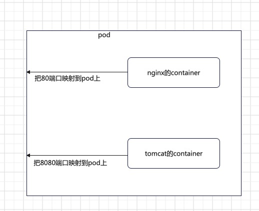

## pod相关


#### pod概述

pod是k8s中最小的可以创建和管理的单元，一个pod中会有1个或多个docker的业务container容器和一个docker的Pause容器，多个业务container共享网络命名空间即多个container是网络共享的。


#### 使用注意点

- pod中多个container

  ```yaml
  kind: Deployment
  apiVersion: apps/v1
  metadata:
    name: nginx-bjy8ec
    namespace: legend
    labels:
      app: nginx
  spec:
    replicas: 1
    selector:
      matchLabels:
        app: nginx
    template:
      metadata:
        labels:
          app: nginx
      spec:
        containers:
          - name: nginx-container-jovkua
            image: 'nginx:1.19-alpine'
            ports:
              - name: tcp-80
                containerPort: 80
                protocol: TCP
            resources:
              requests:
                cpu: 10m
                memory: 10Mi
            terminationMessagePath: /dev/termination-log
            terminationMessagePolicy: File
            imagePullPolicy: IfNotPresent
          - name: tomcat-container-jovkua-1
            image: 'tomcat'
            ports:
              - name: tcp-1-8080
                containerPort: 8080
                protocol: TCP
            resources:
              requests:
                cpu: 10m
                memory: 10Mi
            terminationMessagePath: /dev/termination-log
            terminationMessagePolicy: File
            imagePullPolicy: IfNotPresent
        restartPolicy: Always
  ```

  上面的yaml创建了一个pod，pod内含有2个container，注意：<font color="red">container内的端口会直接映射到pod上，但是pod内有多个container不允许映射到pod的同一个端口上</font>，如下图：

  

  当要查看pod内具体一个container的log的时候，可以先describe这个pod的信息，找到container名称，然后 `kubectl logs pod名称 -c container名称 -n xxxxxx`

  

- pod的镜像拉取策略：

  ```yaml
  ......
  spec:
    containers:
      - name: xxxx
        image: xxxxx
        imagePullPolicy: Always/Never/IfNotPresent #Always每次创建pod都重新拉取一次镜像   
        																					 #Never pod永远不会主动拉取这个镜像
        																					 #IfNotPresent pod所在节点不存在该镜像时才拉取
  ```

- pod的资源限制：

  ```yaml
  ......
  spec:
    containers:
      resources: 
        requests:   #pod调度的时候，node节点最低需要内存64M，cpu为250
          memory: '64Mi'
          cpu: "250m"  #m代表千分之,相当于0.1 个cpu资源
        limits:     #pod运行时最大内存为128M，cpu为500
          memory: '128Mi'
          cpu: "500m"
  ```

- pod的重启机制：

  重启策略只针对于pod，不针对于pod内的container。

  ```yaml
  ......
  spec:
    containers:
      xxxxx
    restartPolicy: Never/OnFailure/Always   #Never  当pod退出时，从不重启容器
    																				#OnFailure 当容器异常退出时（退出状态码非0）才重启容器
    																				#Always 当pod退出时，总是重启容器
  ```

- pod的健康检查

  健康检查是针对于pod内的某一个container的

  ```yaml
  ......
  spec:
    containers:
      - name: xxxx
        image: xxxxx
        livenessProbe/readinessProbe: #livenessProbe pod的存活探针，如果检查失败，将杀死容器，再根据pod配置的重启机制（restartPolicy）来操作！
        														 #readinessProbe pod的就绪探针，如果检查失败，将把pod从service endpoints中剔除，然后去别的node节点中新建pod以提供服务
          exec:                      #Probe支持三种检查方法：1、httpGet，返回200-400范围内的状态码为成功。 2、exec，执行的shell命令返回状态码为0为成功 3、tcpSocket 发起的TCP SOCKET能成功建立为成功
            command:
              - cat
              - /tmp/healthy
          initialDelaySeconds: 5  #表示容器启动后，延时多少秒才开始探测
          periodSeconds: 5      #表示探针的探测周期，即每隔5秒钟执行一下探针
              
  ```

- pod调度之根据node节点的label调度

  ```yaml
  ......
  spec:
  	nodeSelector:   #pod被创建的时候，只有有标签为env_role=dev的node节点才能做为备选节点
  	  env_role: dev 
    containers:
    ......
  ```

- pod调度之硬亲和性调度，也需要先给node节点打上label标签:

  ```yaml
  ......
  spec:
  	affinity:
  	  nodeAffinity:
  	    requiredDuringSchedulingIgnoredDuringExecution: #指明使用硬亲和度
  	    	nodeSelectorTerms:
  	    		- matchExpressions:
  	    			- key: role        #调度的要求是node节点的label标签，role的值不能为master和dev，如果没有则调度失败，pod不会被启动
  	    				operator: NotIn  #operator有： In、NotIn、Exists、Gt、Lt、DoesNotExists
  	    				values:
          			- master
          			- dev
  	    		
    containers:
    ......
  ```

- pod调度之软亲和性调度，也需要先给node节点打上label标签:

  ```yaml
  ......
  spec:
  	affinity:
  	  nodeAffinity:
  	    preferredDuringSchedulingIgnoredDuringExecution: #指明使用软亲和度
  	    	- weight: 1
  	    		preference:
  	    			matchExpressions:
              - key: role        #调度的要求是node节点的label标签，role的值可以为master和dev，如果都没有，则随机找个node节点调度
                operator: In  #operator有： In、NotIn、Exists、Gt、Lt、DoesNotExists
                values:
                - master
                - dev
  	    		
    containers:
    ......
  ```

- pod调度之污点与污点容忍：

  - 污点：

    概念：给node节点打上污点，就相当于与给node节点做个标记

    分为3个值：

    	1. key=value:NoSchedule: 不能容忍此污点的新Pod对象不可调度至当前节点，之前存在当前节点的pod不受影响。
    	1. key=value:PreferNoSchdule: 不能容忍此污点的新Pod对象尽量不要调度至当前节点，不过无其他节点可供调度时也允许接受相应的Pod对象
    	1. key=value:NoExecute: 不能容忍此污点的新Pod对象不可调度至当前节点。且节点上现存的Pod对象因节点污点变动或Pod容忍度变动而不再满足匹配规则时，Pod对象将被驱逐。

  - 污点容忍，在pod中定义好。

    - 定义污点容忍：<font color="red">支持两种操作符，一种是等值比较Equal,表示容忍度与污点必须在key、value和effect三者之上完全匹配；另一种是存在性判断Exists，表示二者的key和effect必须完全匹配，而容忍度中的value字段要使用空值</font>

    - yaml文件演示：

      ```yaml
      .....
      spec:
        containers:
          ......
        tolerations:
          - key: "xxx"
            operator: "Equal"
            value: "yyy"
            effect: "NoSchedule"
            tolerationSeconds: 3600 #表示如果这个 pod 正在运行,然后一个匹配的 taint 被添加到其所在的节点,根据污点和污点容忍，这个pod需要被驱逐，那么 pod 还将继续在节点上运行 3600 秒,之后才会被驱逐
      ```

      

