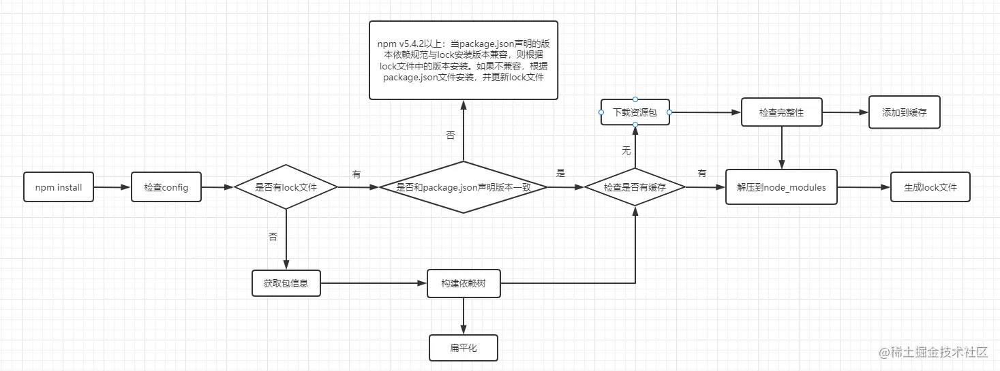

## npm命令的使用


#### 1、安装模块

- 本地安装

  ```shell
  npm install <Module Name>
  ```

  注意 

  1. 这样安装的依赖不会写入到package.json文件中，除非加`--save`参数，写入到package.json的"dependencies"中，加`--save-dev`参数，写入package.json的"devDependencies"中。 加`--legacy-peer-deps`能屏蔽掉npm7和npm6的版本问题！
  2. <Module Name> 是可以不在这儿写的，可以写到package.json文件中，然后直接运行`npm install`

  

  

  将安装包放在 ./node_modules 下（运行 npm 命令时所在的目录），如果没有 node_modules 目录，会在当前执行 npm 命令的目录下生成 node_modules 目录。

- 全局安装

  ```shell
  npm install -g <Module Name>
  或者
  npm install --location=global <Module Name> 
  ```
  
  注意 <Module Name> 是可以不在这儿写的，可以写到package.json文件中，然后直接运行`npm install`
  
  将安装包安装到了系统的全局目录中，全局目录可以通过`npm root -g `或者`npm root --location=global`查看
  
  
  
  这么修改全局安装目录？
  
  ```shell
  npm config set prefix /opt/node_npm_module
  ```
  
  这样就修改了全局安装的目录了。
  
  
  
  <font color="red">运行`npm install ...`之后，依赖会被放到缓存目录中。</font>

- 选择安装模式

  ```shell
  npm install <模式参数>
  ```

  1. --offline： 完全离线模式，安装过程不需要网络，直接使用匹配的缓存数据，一旦缓存数据不存在，则安装失败。
  2. --prefer-offline：优先使用缓存数据，如果没有匹配的缓存数据，则从远程仓库下载。
  3. --prefer-online：优先使用网络数据，忽略缓存数据。


npm安装依赖流程图：



执行npm install之后，检查并获取npm配置，优先级为：

- 项目级.npmrc文件 > 用户级.npmrc文件 > 全局级.npmrc文件 > npm内置.npmrc文件

- 然后检查是否有package-lock.json文件：

  - 如果有：则检查是否和需要的依赖的版本一致（依赖被记录到了package.json中的话，会对比package.json中的版本是否一致）

    - 如果一致，直接使用package-lock.json中的信息

    - 如果不一致，按上图所示的处理。

      

  - 如果没有package-lock.json文件，则根据package.json递归构建依赖树，然后按照构建好的依赖树下载依赖资源

- 下载时会查找是否有缓存：
  - 如果有缓存，则直接将缓存内容解压到node_modules中。
  - 如果没有缓存，则从npm远程仓库下载依赖，然后会检查包的完整性，放到缓存中，再解压到node_modules下。 最后生成package-lock.json。

构建依赖树时，不管是当前项目的直接依赖还是子依赖，都会按照扁平化的原则将其直接放在当前项目的node_modules下。在这个过程中，遇到相同模块就判断已在依赖树中的模块是否符合新模块的版本范围，如果符合则不会再次安装，直接跳过。不符合则会在当前包的node_modules再次安装。


#### 2、缓存操作

<font color="red">运行`npm install ...`之后，依赖会被放到缓存目录中的_cacache中。</font>

- 查看npm的缓存目录

  ```shell
  npm config get cache
  ```

  依赖存储在 上面命令得到的缓存目录中的_cacache目录中，并且不是以模块名直接存放。

- 修改npm缓存目录

  ```shell
  npm config set cache "具体目录"
  ```


具体的缓存中存有哪些东西？

有`content-v2`和 `index-v5` 两个目录：

- content-v2里面基本是一些二进制文件。为使这些文件可读，我们可以把文件做解压缩处理，得到的结果就是npm包资源。

  进入到最中的目录中，里面的文件名义一大串，其实是一个tar包，我们可以对其解压缩

  ```shell
  [root@centos d1]tar zxvf 9b58b7ddd1e50f69b8645d4566d23afdd...........d03b39802b362a6110084a84617
  [root@centos d1]# ls
  9b58b7ddd1e50f69b8645d4566d23f2ebaf444c93879a2f45afddca8c3f06a01b649c82fb97d4f88cd03b39802b362a6110084a8461750af778867f3d7aa  package
  [root@centos d1]# cd package/
  [root@centos package]# ls
  HISTORY.md  index.js  LICENSE  package.json  README.md
  ```

  解压后多出一个package目录，里面就是放的依赖的文件。

- index-v5也是类似的东西。


#### 3、查看全局安装的依赖

```shell
npm list --location=global
```


#### 4、查看某个依赖的具体版本

```shewll
npm list module_name [--location=global]
```

加了`--location=global`是查看全局安装了的某个依赖的具体版本


#### 5、卸载依赖

```shell
npm uninstall module_name [--location=global]
```


#### 6、查看所有能修改的配置项

```shell
npm config list --json
```

- 配置国内npm镜像地址

  ```shell
  npm config set registry https://registry.npm.taobao.org
  ```

  测试是否成功，只要运行`npm config get registry`看下是不是我们配置的地址就行！

- 修改全局安装目录

  ```shell
  npm config set prefix /opt/node_npm_module
  ```

  

