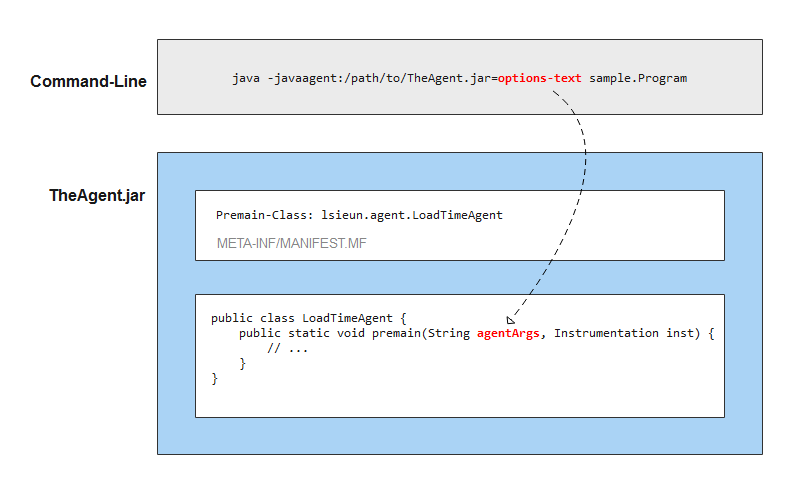

## Load-Time: agentArgs参数


## 1. 命令行启动

### 1.1. Command-Line

从命令行启动Java Agent需要使用`-javagent`选项：

```
-javaagent:jarpath[=options]
```

- `jarpath` 是指定探针项目的jar包路径
- `options` 是探针需要的传参


### 1.2. Agent Jar

在`TheAgent.jar`中，依据`META-INF/MANIFEST.MF`里定义`Premain-Class`属性找到Agent Class:

```
Premain-Class: lsieun.agent.LoadTimeAgent
```


```
public class LoadTimeAgent {
    public static void premain(String agentArgs, Instrumentation inst) {
        // ...
    }
}
```

然后参数被传递到了premain的agentArgs参数中



## 2. 示例一：读取agentArgs

### 2.1. LoadTimeAgent.java

```java
package lsieun.agent;

import java.lang.instrument.Instrumentation;

public class LoadTimeAgent {
    public static void premain(String agentArgs, Instrumentation inst) {
        System.out.println("Premain-Class: " + LoadTimeAgent.class.getName());
        System.out.println("agentArgs: " + agentArgs);
        System.out.println("Instrumentation Class: " + inst.getClass().getName());
    }
}
```

### 2.2. 运行

每次修改代码之后，都需要重新生成`.jar`文件：

```
mvn clean package
```

在使用`-javagent`选项时不添加`options`信息：

```
$ java  -javaagent:./target/TheAgent.jar -jar xxx.jar

```

输出

```shell
Premain-Class: lsieun.agent.LoadTimeAgent
agentArgs: null
Instrumentation Class: sun.instrument.InstrumentationImpl
```

从上面的输出结果中，我们可以看到：

- 第一点，`agentArgs`的值为`null`。
- 第二点，`Instrumentation`是一个接口，它的具体实现是`sun.instrument.InstrumentationImpl`类。


在使用`-javagent`选项时添加`options`信息：

```
$ java -javaagent:./target/TheAgent.jar=this-is-a-long-message -jar xxx.jar

```

输出

```shell
Premain-Class: lsieun.agent.LoadTimeAgent
agentArgs: this-is-a-long-message
Instrumentation Class: sun.instrument.InstrumentationImpl
```


## 3. 示例二：解析agentArgs

我们传入的信息，一般情况下是`key-value`的形式，有人喜欢用`:`分隔，有人喜欢用`=`分隔：

```
username:tomcat,password:123456
username=tomcat,password=123456
```

### 3.1. LoadTimeAgent.java

```java
package lsieun.agent;

import java.lang.instrument.Instrumentation;

public class LoadTimeAgent {
    public static void premain(String agentArgs, Instrumentation inst) {
        System.out.println("Premain-Class: " + LoadTimeAgent.class.getName());
        System.out.println("agentArgs: " + agentArgs);
        System.out.println("Instrumentation Class: " + inst.getClass().getName());

        if (agentArgs != null) {
            String[] array = agentArgs.split(",");
            int length = array.length;
            for (int i = 0; i < length; i++) {
                String item = array[i];
                String[] key_value_pair = getKeyValuePair(item);

                String key = key_value_pair[0];
                String value = key_value_pair[1];

                String line = String.format("|%03d| %s: %s", i, key, value);
                System.out.println(line);
            }
        }
    }

    private static String[] getKeyValuePair(String str) {
        {
            int index = str.indexOf("=");
            if (index != -1) {
                return str.split("=", 2);
            }
        }

        {
            int index = str.indexOf(":");
            if (index != -1) {
                return str.split(":", 2);
            }
        }
        return new String[]{str, ""};
    }
}
```

### 3.2. 运行

第一次运行，使用`:`分隔：

```
$ java  -javaagent:./target/TheAgent.jar=username:tomcat,password:123456 -jar xxx.jar

```

输出：

```shell
Premain-Class: lsieun.agent.LoadTimeAgent
agentArgs: username:tomcat,password:123456
Instrumentation Class: sun.instrument.InstrumentationImpl
|000| username: tomcat
|001| password: 123456
```


第二次运行，使用`=`分隔：

```
$ java -javaagent:./target/TheAgent.jar=username=jerry,password=12345 -jar xxx.jar
```

输出：

```shell
Premain-Class: lsieun.agent.LoadTimeAgent
agentArgs: username=jerry,password=12345
Instrumentation Class: sun.instrument.InstrumentationImpl
|000| username: jerry
|001| password: 12345
```

