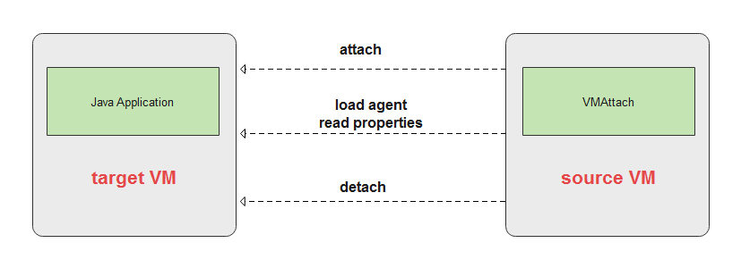

## Dynamic Agent的Attach API详解


## 1. Attach API

在进行Dynamic Instrumentation的时候，我们需要用到Attach API，它允许一个JVM连接到另一个JVM。

> 作用：允许一个JVM连接到另一个JVM

Attach API是在Java 1.6引入的。

> 时间：Java 1.6之后

在Attach API当中，主要的类位于`com.sun.tools.attach`包，它有版本的变化：

- 在Java 8版本，`com.sun.tools.attach`包位于`JDK_HOME/lib/tools.jar`文件。
- 在Java 9版本之后，`com.sun.tools.attach`包位于`jdk.attach`模块（`JDK_HOME/jmods/jdk.attach.jmod`文件）。

> 位置：tools.jar文件或jdk.attach模块

我们主要使用Java 8版本。


在`com.sun.tools.attach`包当中，包含的类内容如下：

> com.sun.tools.attach有哪些主要的类

```
                        ┌─── spi ──────────────────────────────┼─── AttachProvider
                        │
                        ├─── AgentInitializationException
                        │
                        ├─── AgentLoadException
                        │
                        ├─── AttachNotSupportedException
com.sun.tools.attach ───┤
                        ├─── AttachOperationFailedException
                        │
                        ├─── AttachPermission
                        │
                        ├─── VirtualMachine
                        │
                        └─── VirtualMachineDescriptor
```

在上面这些类当中，我们忽略掉其中的Exception和Permission类，简化之后如下：

```
                        ┌─── spi ────────────────────────┼─── AttachProvider
                        │
com.sun.tools.attach ───┼─── VirtualMachine
                        │
                        └─── VirtualMachineDescriptor
```

在这三个类当中，核心的类是`VirtualMachine`类，代码围绕着它来展开； `VirtualMachineDescriptor`类比较简单，就是对几个字段（id、provider和display name）的包装； 而`AttachProvider`类提供了底层实现。

## 2. VirtualMachine

 `com.sun.tools.attach.VirtualMachine` 表示此 Java 虚拟机已附加到的 Java 虚拟机. 它所附加的 Java 虚拟机有时称为**目标虚拟机**，或**目标 VM**.



使用`VirtualMachine`类，我们分成三步：

- 第一步，与target VM建立连接，获得一个`VirtualMachine`对象。
- 第二步，使用`VirtualMachine`对象，可以将Agent Jar加载到target VM上，也可以从target VM读取一些属性信息。
- 第三步，与target VM断开连接。

```
                                       ┌─── VirtualMachine.attach(String id)
                  ┌─── 1. Get VM ──────┤
                  │                    └─── VirtualMachine.attach(VirtualMachineDescriptor vmd)
                  │
                  │                                            ┌─── VirtualMachine.loadAgent(String agent)
                  │                    ┌─── Load Agent ────────┤
VirtualMachine ───┤                    │                       └─── VirtualMachine.loadAgent(String agent, String options)
                  ├─── 2. Use VM ──────┤
                  │                    │                       ┌─── VirtualMachine.getAgentProperties()
                  │                    └─── read properties ───┤
                  │                                            └─── VirtualMachine.getSystemProperties()
                  │
                  └─── 3. detach VM ───┼─── VirtualMachine.detach()
```

### 2.1. Get VM

#### 2.1.1. attach()方式一

通过使用标识目标虚拟机的标识符调用 attach 方法来获得 VirtualMachine。标识符是依赖于实现的，但在每个 Java 虚拟机在其自己的操作系统进程中运行的环境中通常是进程标识符（或 pid）

```
public abstract class VirtualMachine {
    public static VirtualMachine attach(String id) throws AttachNotSupportedException, IOException {
        // ...
    }
}
```

#### 2.1.2. attach()方式二

通过使用从列表方法返回的虚拟机描述符列表中获得的 VirtualMachineDescriptor 调用附加方法来获取 VirtualMachine 实例。

```
public abstract class VirtualMachine {
    public static VirtualMachine attach(VirtualMachineDescriptor vmd) throws AttachNotSupportedException, IOException {
        // ...
    }
}
```

### 2.2. Use VM

#### 2.2.1. Load Agent

一旦获得对虚拟机的引用，就会使用 loadAgent、loadAgentLibrary 和 loadAgentPath 方法将代理加载到目标虚拟机中。

- The `loadAgent` method 用于加载用 Java 语言编写并部署在 JAR 文件中的代理。<font color="red">我们只需要掌握这个。</font>

  ```java
  public abstract class VirtualMachine {
      public void loadAgent(String agent) throws AgentLoadException, AgentInitializationException, IOException {
          loadAgent(agent, null);
      }
      
      public abstract void loadAgent(String agent, String options)
              throws AgentLoadException, AgentInitializationException, IOException;    
  }
  ```

  

- The `loadAgentLibrary` and `loadAgentPath` methods 用于加载部署在动态库中或静态链接到 VM 中的代理，并使用 JVM 工具接口.

#### 2.2.2. read properties

除了加载代理之外，`VirtualMachine` 还提供对目标 VM 中的**系统属性**的读取访问。这在某些环境中很有用，在这些环境中，诸如“java.home”、“os.name”或“os.arch”之类的属性用于构建将加载到目标 VM 中的代理的路径。

```
public abstract class VirtualMachine {
    public abstract Properties getSystemProperties() throws IOException;
    public abstract Properties getAgentProperties() throws IOException;
}
```

这两个方法的区别：`getAgentProperties()`是vm为agent专门维护的属性。

- `getSystemProperties()`: 此方法返回目标虚拟机中的系统属性。键或值不是 String 的属性将被忽略。方法大致等同于方法的调用 `System.getProperties()` in the target virtual machine except that properties with a key or value that is not a `String` are not included.
- `getAgentProperties()`: 目标虚拟机可以代表代理维护一个属性列表。完成此操作的方式、属性的名称以及允许的值类型是特定于实现的。代理属性通常用于存储通信端点和其他代理配置详细信息。

### 2.3. Detach VM

与虚拟机分离.

```
public abstract class VirtualMachine {
    public abstract void detach() throws IOException;
}
```

### 2.4. 其他方法

第一个是`id()`方法，它返回target VM的进程ID值。

```
public abstract class VirtualMachine {
    private final String id;

    public final String id() {
        return id;
    }
}
```

第二个是`list()`方法，它返回一组`VirtualMachineDescriptor`对象，描述所有潜在的target VM对象。

```
public abstract class VirtualMachine {
    public static List<VirtualMachineDescriptor> list() {
        // ...
    }
}
```

第三个是`provider()`方法，它返回一个`AttachProvider`对象。

```
public abstract class VirtualMachine {
    private final AttachProvider provider;

    public final AttachProvider provider() {
        return provider;
    }
}
```

## 3. VirtualMachineDescriptor

A `com.sun.tools.attach.VirtualMachineDescriptor` 用于描述 Java 虚拟机的容器类

```
public class VirtualMachineDescriptor {
    private String id;
    private String displayName;
    private AttachProvider provider;

    public String id() {
        return id;
    }
    
    public String displayName() {
        return displayName;
    }
    
    public AttachProvider provider() {
        return provider;
    }    
}
```

- **an identifier** that identifies a target virtual machine.
- **a reference** to the `AttachProvider` that should be used when attempting to attach to the virtual machine.
- The **display name** is typically a human readable string that a tool might display to a user.

`VirtualMachineDescriptor` 实例通常是通过调用 `VirtualMachine.list()` 方法创建的。这将返回描述符的完整列表，以描述所有已安装的附加提供程序已知的 Java 虚拟机

## 4. AttachProvider

`com.sun.tools.attach.spi.AttachProvider`是一个抽象类，它需要一个具体的实现：

```
public abstract class AttachProvider {
    //...
}
```

不同平台上的JVM，它对应的具体`AttachProvider`实现是不一样的：

- Linux: `sun.tools.attach.LinuxAttachProvider`
- Windows: `sun.tools.attach.WindowsAttachProvider`

附加提供程序实现通常与 Java 虚拟机实现、版本甚至操作模式相关联。也就是说，**特定的提供程序实现**通常只能附加到**特定的 Java 虚拟机实现或版本**。例如，Sun 的 JDK 实现附带了只能附加到 Sun 的 HotSpot 虚拟机的提供程序实现

An attach provider is identified by its `name` and `type`:

- `name` 通常是与 VM 供应商相对应的名称，但并非必须如此。例如，Sun JDK 实现附带使用名称“sun”的附加提供程序。
- `type` 通常对应于附加机制。例如，使用 Doors 进程间通信机制的实现可能使用类型“doors”。

`name` 和 `type` 的目的是在安装了多个提供程序的环境中识别提供程序。


## 5. 总结

本文内容总结如下：

- 第一点，Attach API位于

  ```plaintext
  com.sun.tools.attach
  ```

  包：

  - 在Java 8版本，`com.sun.tools.attach`包位于`JDK_HOME/lib/tools.jar`文件。
  - 在Java 9版本之后，`com.sun.tools.attach`包位于`jdk.attach`模块（`JDK_HOME/jmods/jdk.attach.jmod`文件）。

- 第二点，在`com.sun.tools.attach`包当中，重要的类有三个：`VirtualMachine`（核心功能）、`VirtualMachineDescriptor`（三个属性）和`AttachProvider`（底层实现）。

- 第三点，使用

  ```plaintext
  VirtualMachine
  ```

  类分成三步：

  - 第一步，与target VM建立连接，获得一个`VirtualMachine`对象。
  - 第二步，使用`VirtualMachine`对象，可以将Agent Jar加载到target VM上，也可以从target VM读取一些属性信息。
  - 第三步，与target VM断开连接。