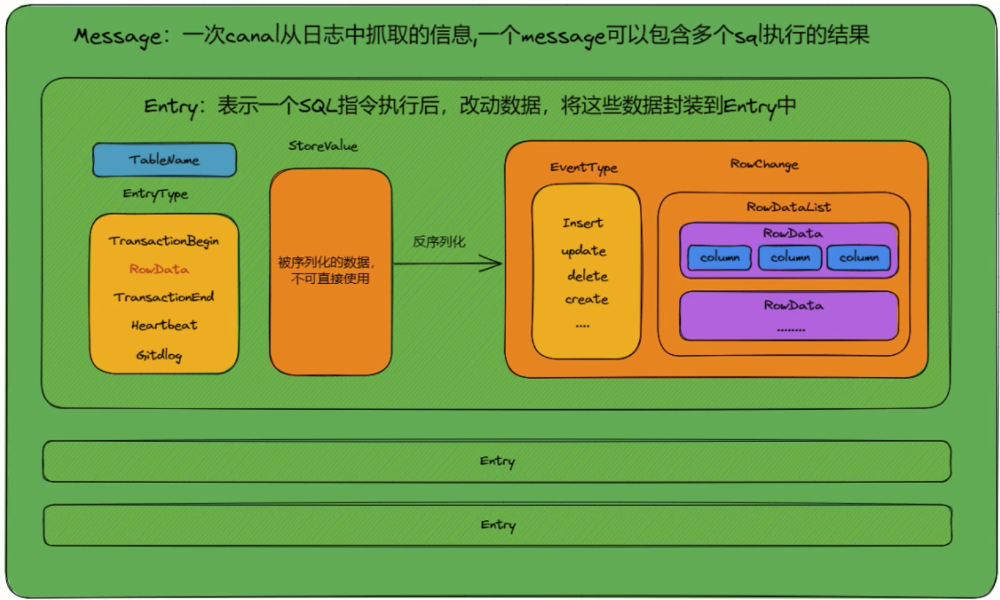

## docker部署canal服务器端


#### 1、端口占用说明

````shell
11111端口：server端默认开放提供给client连接至服务端的端口
````


#### 2、部署canal服务端

参考官方：https://github.com/alibaba/canal/wiki/Docker-QuickStart

- 拉取canal镜像

  ```shell
  docker pull canal/canal-server:v1.1.6
  ```

- 下载官方提供的启动脚本

  下载参考地址：https://github.com/alibaba/canal/wiki/Docker-QuickStart，注意下载好之后把内部的canal的版本改成需要的版本，网络模式去掉，端口暴露方式手动添加 -p，这样就会把所有端口都暴露出来了！

- 启动canal容器

  ```shell
  sh run.sh -e canal.auto.scan=true \
  			-e canal.port=11111 \ #指定canal启动的端口
  			-e canal.serverMode=tcp \
  		  -e canal.destinations=test \ #配置一个实例，名称为test，容器运行后会在conf目录中生成对应实例的文件夹，文件夹内部存放该实例的配置文件instance.properties，注意这儿只能配置一个，因为docker模式下，单docker实例只能运行一个instance，主要为配置问题。如果需要运行多instance时，可以自行制作一份docker镜像即可
  		  -e canal.instance.master.address=127.0.0.1:3306  \ #需要被同步的mysql地址
  		  -e canal.instance.dbUsername=canal  \      #授权有权限进行同步的用户名
  		  -e canal.instance.dbPassword=canal  \				#授权有权限进行同步的密码
  		  -e canal.instance.connectionCharset=UTF-8 \
  		  -e canal.instance.tsdb.enable=true \
  		  -e canal.instance.gtidon=false  \
  		  -e canal.instance.filter.regex=.*\\..* \
  ```

  <font color="red">-e参数里可以指定以前canal.properties/instance.properties里的所有配置的key和value，canal-server启动时会有限读取-e指定的变量。</font>更多变量参考：https://github.com/alibaba/canal/wiki/AdminGuide

  重点参数说明：

  1. canal.serverMode参数
     - canal.serverMode为tcp的时候，证明客户端是一个使用tcp协议的客户端，如果我们的客户端是java代码操作，这儿就用tcp
     - canal.serverMode为kafka
     - canal.serverMode为rocketMQ
     - canal.serverMode为rabbitMQ

  

  2. canal.instance.filter.regex参数，只有在row模式下这个配置才会生效！
     - canal.instance.filter.regex值为： .* 或者 .\*\\\\.\.\* 表示为所有表
     - canal.instance.filter.regex值为： canal\\\\..\* 表示canal库下的所有表
     - canal.instance.filter.regex值为：canal\\\\.canal.\* 表示canal库下的以canal开头的表
     - canal.instance.filter.regex值为：canal.test1表示canal库下的test1
     - canal.instance.filter.regex值为：canal\\\\..\* ,mysql.test1,mysql.test2 使用逗号分隔，表示多条件组合

  

  


#### 3、测试是否部署成功

- 本地创建一个普通的springboot项目

- 引入依赖

  ```xml
  <dependency>
    <groupId>com.alibaba.otter</groupId>
    <artifactId>canal.client</artifactId>
    <version>1.1.4</version>
  </dependency>
  ```

- 编写如下类，去canal的服务端获取mysql的数据变动信息

  ```java
  @Component
  public class MyCanalClient {
  
      public void run() throws InvalidProtocolBufferException {
          // 创建链接
          CanalConnector connector = CanalConnectors.newSingleConnector(new InetSocketAddress("10.10.210.24",
                  11111), "test", "", "");
          int batchSize = 1000;
          try {
              connector.connect();
              connector.subscribe("saas-fast-parking\\..*"); //如果要精确到几张表，可以写成这样的格式saas-fast-parking.t_tenant,saas-fast-parking.sys_dept 用逗号分隔
              connector.rollback();
              while (true) {
                  Message message = connector.getWithoutAck(batchSize); // 获取指定数量的数据
                  long batchId = message.getId();
                  int size = message.getEntries().size();
                  if (batchId == -1 || size == 0) {
                      try {
                          Thread.sleep(1000L);
                      } catch (InterruptedException e) {
                          throw new RuntimeException(e);
                      }
                  } else {
                      dataHandle(message.getEntries());
                  }
  
                  connector.ack(batchId); // 提交确认
                  // connector.rollback(batchId); // 处理失败, 回滚数据
              }
          } finally {
              connector.disconnect();
          }
      }
  
      private void dataHandle(List<CanalEntry.Entry> entrys) throws InvalidProtocolBufferException {
          for (CanalEntry.Entry entry : entrys) {
              //获取到操作的表名
              String tableName = entry.getHeader().getTableName();
  
              //获取到Entry 类型
              CanalEntry.EntryType entryType = entry.getEntryType();
  
              //判断entryType为ROWDATA类型
              if(CanalEntry.EntryType.ROWDATA.equals(entryType)){
  
                  //获取到序列化数据
                  ByteString storeValue = entry.getStoreValue();
  
                  //反序列化数据
                  CanalEntry.RowChange rowChange = CanalEntry.RowChange.parseFrom(storeValue);
  
                  //获取事件类型是 INSERT还是UPDATE等
                  CanalEntry.EventType eventType = rowChange.getEventType();
  
                  //获取具体的数据
                  List<CanalEntry.RowData> rowDataList = rowChange.getRowDatasList();
                  //遍历数据
                  for (CanalEntry.RowData rowData: rowDataList){
                      //获取到变化之前的列信息
                      List<CanalEntry.Column> beforeColumnsList = rowData.getBeforeColumnsList();
                      Map<String, Object> beforeColumnMap = new HashMap<>();
                      for (CanalEntry.Column column: beforeColumnsList){
                          beforeColumnMap.put(column.getName(), column.getValue());
                      }
  
                      //获取变化之后的列信息
                      List<CanalEntry.Column> afterColumnsList = rowData.getAfterColumnsList();
                      Map<String, Object>afterColumnMap = new HashMap<>();
                      for (CanalEntry.Column column: afterColumnsList){
                          afterColumnMap.put(column.getName(), column.getValue());
                      }
  
                      System.out.println("表名：" + tableName + ", 操作类型：" + eventType);
                      System.out.println("改前：" + beforeColumnMap);
                      System.out.println("改后：" + afterColumnMap);
  
                  }
  
              }
          }
      }
  
  }
  ```

  在上述代码中有很多陌生的类，比如Message、Entry类等等，这些类都是canal-client从canal-server端拿到的数据后对数据进行封装后形成的，大致的类关系如下图

  

- 修改springboot的项目入口文件

  ```java
  @SpringBootApplication
  public class Demo555Application implements CommandLineRunner { //实现CommandLineRunner接口
  
      @Autowired
      MyCanalClient canalClient;
  
      public static void main(String[] args) {
          SpringApplication.run(Demo555Application.class, args);
      }
  
      @Override
      public void run(String... args) throws Exception { //重写CommandLineRunner的run方法
          canalClient.run();
      }
  }
  ```

  启动项目，然后去数据库改下数据，看看输出是否有变化，有变化证明成功了！