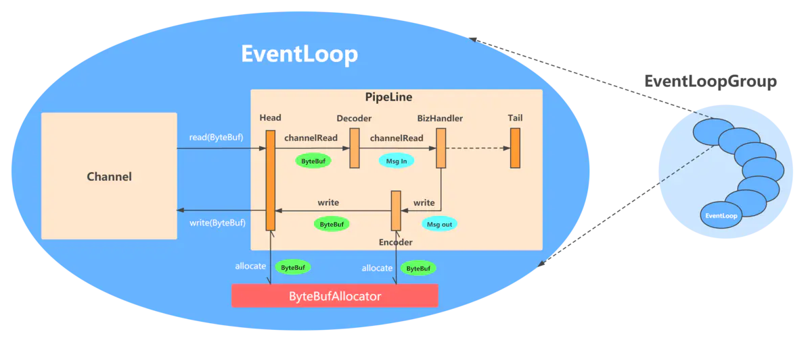

## Netty的组成部分

#### 整体架构

#### 组成部分

- Channel

  其实就是每个socket连接，其中，NioServerSocketChannel代表一个正在监听的端口，并没有真正建立一条连接。SocketChannel是一条真正的连接。

- Pipeline

  每个Channel会被分配一个Pipeline的实例。在PipeLine中有一条由多个ChannelHandlderContext组成的双向链表，而一个ChannelHandlerContext中有一个ChannelHandler。其中的Head和Tail是PipeLine中内置的两个特殊的ChannelHandlerContext。其他的ChannelHandlerContext例如Decoder、BizHandler和Encoder均由用户添加。PipeLine控制着Channel有关的**事件和命令**在各个ChannelHandlerContext中传播。

- ChannelHandler

  处理Channel上有关的事件和命令的处理器，每一个ChannelHandler都会被封装成ChannleHandlerContext加入Pipeline。netty中的ChannelHandler分为ChannelInBoundHandler和ChannelOutBoundHandler，其中ChannelInBoundHandler处理Channel读有关的事件，而ChannelOutBoundHandler处理Channel写有关的命令。当然一个ChannelHandler可以同时是ChannelInBoundHandler和ChannelOutBoundHandler。

- ByteBuf

  ByteBuf对应着jdk中的ByteBuffer，是字节数据容器。

- ByteBufferAllocator

  上面我们提到了ByteBuf，那么ByteBuf从哪里生成呢，就是从ByteBufferAllocator生成的。

- EventLoop

  EventLoop其实是一个线程池，但是只能接收一个线程，所以可以认为他就是一个线程，netty中为每一个Channel绑定一个EventLoop，所有关于该Channel的端口绑定、建立连接、读写操作等全部由该EventLoop完成，如果调用线程不是EventLoop线程，那么该调用将被封装成异步任务交给EventLoop完成。这也就是为什么netty中到处都在返回Future的原因，我们在编程中调用的netty的大部分方法都会返回一个Future。

- EventLoopGroup

  EventLoopGroup是一组EventLoop的集合，在创建Channel时netty会轮询地从EventLoopGroup中选择一个EventLoop绑定到Channel上，一旦绑定完成，这个EventLoop就要为这个Channel劳作一生。