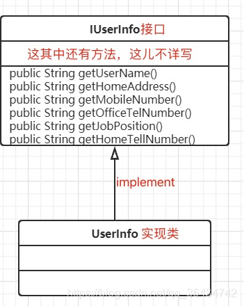
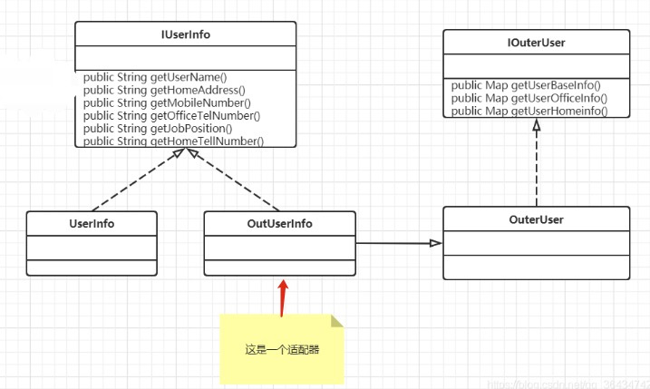

## 适配器模式

> 在实际开发中，我们正在开发A系统的用户模块，突然上头发话了，要把B系统的用户模块兼容进来，那怎么做呢？就需要用适配器模式。


- 概念

​	A系统的用户体系长这样：



​	B系统的用户体系长这样：


​	A系统用户体系目前需要兼容B系统的用户体系，那么就需要一个适配器：



​	<font color="red">OutUserInfo 继承 OutUser类，并实现IUserInfo接口。在OutUserInfo类中执行super.getXXXX()方法把OutUser的信息获取到，设置到UserInfo中，就完成了一个适配器所需要做的事情！</font>


- 代码实践

  IUserInfo接口代码

  ```java
  public interface IUserInfo {
  
      //获得用户姓名
      public String getUserName();
  
      //获得家庭地址
      public String getHomeAddress();
  
      //手机号码，这个太重要，手机泛滥呀
      public String getMobileNumber();
  
      //办公电话，一般式座机
      public String getOfficeTelNumber();
  
      //这个人的职位是啥
      public String getJobPosition();
  
      //获得家庭电话，这个有点缺德，我是不喜欢打家庭电话讨论工作
      public String getHomeTelNumber();
  }
  
  ```

  UserInfo类代码

  ```java
  public class UserInfo implements IUserInfo {
      //获得家庭地址，下属送礼也可以找到地方
      public String getHomeAddress() {
          System.out.println("这里是员工的家庭地址....");
          return null;
      }
  
      /*
       * 获得家庭电话号码
       */
      public String getHomeTelNumber() {
          System.out.println("员工的家庭电话是....");
          return null;
      }
  
      /*
       * 员工的职位，是部门经理还是小兵
       */
      public String getJobPosition() {
          System.out.println("这个人的职位是BOSS....");
          return null;
      }
  
      /*
       * 手机号码
       */
      public String getMobileNumber() {
          System.out.println("这个人的手机号码是0000....");
          return null;
      }
  
      /*
       * 办公室电话，烦躁的时候最好“不小心”把电话线踢掉，我经常这么干，对己对人都有好处
       */
      public String getOfficeTelNumber() {
          System.out.println("办公室电话是....");
          return null;
      }
  
      /*
       * 姓名了，这个老重要了
       */
      public String getUserName() {
          System.out.println("姓名叫做...");
          return null;
      }
  }
  ```

  IOutUser接口代码

  ```java
  public interface IOutUser {
  
      //基本信息，比如名称，性别，手机号码了等
      public Map getUserBaseInfo();
  
      //工作区域信息
      public Map getUserOfficeInfo();
  
      //用户的家庭信息
      public Map getUserHomeInfo();
  }
  ```

  OutUser类代码

  ```java
  public class OutUser implements IOutUser {
      /*
       * 用户的基本信息
       */
      public Map getUserBaseInfo() {
          HashMap baseInfoMap = new HashMap();
          baseInfoMap.put("userName", "这个员工叫混世魔王....");
          baseInfoMap.put("mobileNumber", "这个员工电话是....");
          return baseInfoMap;
      }
  
      /*
       * 员工的家庭信息
       */
      public Map getUserHomeInfo() {
          HashMap homeInfo = new HashMap();
          homeInfo.put("homeTelNumbner", "员工的家庭电话是....");
          homeInfo.put("homeAddress", "员工的家庭地址是....");
          return homeInfo;
      }
  
      /*
       * 员工的工作信息，比如职位了等
       */
      public Map getUserOfficeInfo() {
          HashMap officeInfo = new HashMap();
          officeInfo.put("jobPosition", "这个人的职位是BOSS...");
          officeInfo.put("officeTelNumber", "员工的办公电话是....");
          return officeInfo;
      }
  }
  ```

  适配器OutUserInfo类的代码

  ```java
  public class OutUserInfo extends OutUser implements IUserInfo {
      private Map baseInfo = super.getUserBaseInfo(); //员工的基本信息
      private Map homeInfo = super.getUserHomeInfo(); //员工的家庭 信息
      private Map officeInfo = super.getUserOfficeInfo(); //工作信息
      /*
       * 家庭地址
       */
      public String getHomeAddress() {
          String homeAddress = (String)this.homeInfo.get("homeAddress");
          System.out.println(homeAddress);
          return homeAddress;
      }
      /*
       * 家庭电话号码
       */
      public String getHomeTelNumber() {
          String homeTelNumber = (String)this.homeInfo.get("homeTelNumber");
          System.out.println(homeTelNumber);
          return homeTelNumber;
      }
      /*
       *职位信息
       */
      public String getJobPosition() {
          String jobPosition = (String)this.officeInfo.get("jobPosition");
          System.out.println(jobPosition);
          return jobPosition;
      }
      /*
       * 手机号码
       */
      public String getMobileNumber() {
          String mobileNumber = (String)this.baseInfo.get("mobileNumber");
          System.out.println(mobileNumber);
          return mobileNumber;
      }
  
      /*
       * 办公电话
       * */
      public String getOfficeTelNumber() {
          String officeTelNumber = (String)this.officeInfo.get("officeTelNumber");
          System.out.println(officeTelNumber);
          return officeTelNumber;
      }
      /*
       * 员工的名称
       */
      public String getUserName() {
          String userName = (String)this.baseInfo.get("userName");
          System.out.println(userName);
          return userName;
      }
  }
  ```

  使用

  ```java
  public static void main(String[] args) {
    for (int i = 0; i< 101; i++){
      
      IUserInfo user = new OutUserInfo(); //只要修改这一行 就可以做到灵活切换
      user.getMobileNumber();
    }
  }
  ```

  


