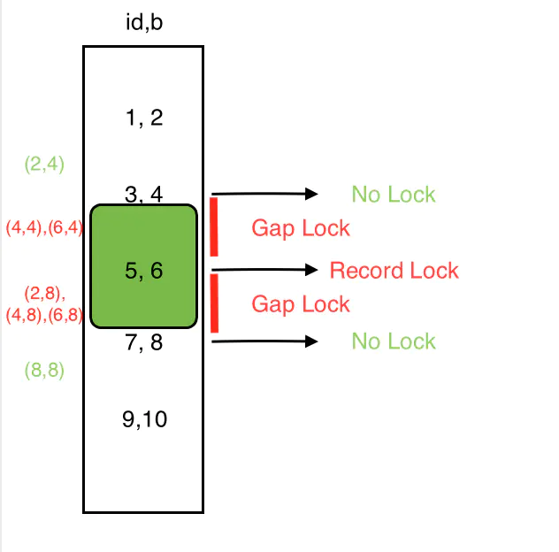

## 锁的种类

> 两条sql语句必须带有相同种类的锁，才会去竞争锁。

#### 1、独占式写锁（悲观锁）

- 概念：

  加了这个锁，只有当前连接是可以带锁的读写数据，其它连接的带任意锁的读、带独占锁的写都需要等待，此时考虑事务的隔离级别。

- 如何上锁呢？

  update、delete、select .....for update就会加上

#### 2、共享式读锁（乐观锁）

- 概念：

  加了这个锁，只有当前连接可以带共享式读锁的读、带独占式写锁的写数据，其它的连接带任意锁可以读取数据不用等待，但是带独占式写锁的写数据需要等待。

- 如何上锁？

  select ...... lock in share mode就会加上

#### 3、表锁

- 概念：

  锁住整张表，一般不用，因为效率太低。

- 如何上锁？

  当select .....for update/lock in share mode 没有使用索引或索引失效，那么自动从行锁转成表锁。

- 情况演示：

  - 演示查询条件没有命中索引且是独占式写锁，行锁退化成表锁的情况，步骤如下：

    1. 使用我们准备好的pd_school_student_topic_log表，

    2. 一个连接更新student_id = 1，把course_id更新到1。或者是 select ... from pd_school_student_topic_log where student_id = 1 for update;的查询操作。

    3. 然后，一个连接更新student_id = 2，把course_id更新到2

    4. 发现更新student_id = 2这个数据的连接，执行到更新语句的时候会一直卡住，这儿就充分证明了被锁表了

    5. 更新student_id = 1的连接执行commit操作

    6. 更新student_id = 2的连接不卡了

    7. 更新student_id = 2的连接执行commit操作

       

  - 演示查询条件没有命中索引且是共享式读锁，行锁退化成表锁的情况，步骤如下：

    1. 使用我们准备好的pd_school_student_topic_log表，

    2. 使用select ... from pd_school_student_topic_log where student_id = 1 lock in share mode;的查询操作。

    3. 然后，一个连接更新student_id = 2，把course_id更新到2

    4. 发现更新student_id = 2这个数据的连接，执行到更新语句的时候会一直卡住，这儿就充分证明了被锁表了

    5. 更新student_id = 1的连接执行commit操作

    6. 更新student_id = 2的连接不卡了

    7. 更新student_id = 2的连接执行commit操作

       

  - 演示查询条件索引失效且是独占式写锁，行锁退化成表锁的情况，步骤如下：

    1. 使用我们准备好的pd_school_student_topic_log表，

    2. 给pd_school_student_topic_log表新增一个索引，index(student_id)

    3. 然后一个连接执行`select * from pd_school_student_topic_log where student_id = 1 or course_id = 1 for update;`因为使用了or关键字且course_id没有索引，此时索引失效。

    4. 然后，一个连接更新student_id = 2，把course_id更新到3

    5. 发现更新student_id = 2这个数据的连接，执行到更新语句的时候会一直卡住，这儿就充分证明了被锁表了

    6. 查询的连接执行commit操作

    7. 更新student_id = 2的连接不卡了

    8. 更新student_id = 2的连接执行commit操作

       

  - 演示查询条件索引失效且是共享式读锁，行锁退化成表锁的情况，步骤如下：

    1. 使用我们准备好的pd_school_student_topic_log表，
    2. 给pd_school_student_topic_log表新增一个索引，index(student_id)
    3. 然后一个连接执行`select * from pd_school_student_topic_log where student_id = 1 or course_id = 1 lock in share mode;`因为使用了or关键字且course_id没有索引，此时索引失效。
    4. 然后，一个连接更新student_id = 2，把course_id更新到3
    5. 发现更新student_id = 2这个数据的连接，执行到更新语句的时候会一直卡住，这儿就充分证明了被锁表了
    6. 查询的连接执行commit操作
    7. 更新student_id = 2的连接不卡了
    8. 更新student_id = 2的连接执行commit操作

  

  

#### 4、行锁

- 概念：

  就是锁住表中具体某一行或某几行

- 如何上锁？

  update、delete某一行或某几行的数据，会自动上行锁

  select .....for update/lock in share mode 会自动给某一行或某几行上行锁，但是前提是使用了索引且索引有效的情况下，索引失效或者没有索引的情况下，会转为表锁。

#### 5、间隙锁

- 概念：

  因为在可重复读的隔离级别下，还是会出现幻读的问题。使用间隙锁就是为了解决幻读的问题。

- 使用：

  1. 在事务A的查询上，必需要带上锁，且一定要是行级锁，才能触发间隙锁。

  2. 在索引中，存储的主键会参于小范围排序，而影响间隙锁。比如下图：

     

     

  3. 唯一索引(主键索引也是)，等值查询，不会有间隙锁，因为记录只会是一条。

  4. 普通索引，等值查询，会有间隙锁，因为记录可能会有多条，肯定会有间隙。

- 使用示例：

  1. 使用我们的te表，干掉所有数据，新增如下数据：`insert into `te` (`id`,`username`, `age`, `addr`) values (1, "tangwei", 10, "常州"),(3, "litong", 30, "常州"),(5, "zhouyan", 20, "常州"), (7, "fanbin", 40, "常州");`

  2. 因为是解决幻读的，所以需要建立2个mysql的连接，并把隔离级别改为RR

  3. 因为上间隙锁必须要使用行级锁，所以age必须上一个索引（一定不能为唯一索引）

  4. 一个连接开启事务，并运行 `select * from te where age = 30 for update`; 先按age进行排序，再决定间隙锁的范围。

  5. 另一个连接开启事务，并执行`insert into te(id, username, age ,addr) values (6, "tangxinhe", 33, "常州");`此时你会发现会阻塞不执行，表示这儿已经上了间隙锁

  6. 执行查询的那么连接执行commit操作

  7. 阻塞的连接立马就恢复了，并可以执行commit操作。

     

     

     间隙锁看懂下面的例子：

     +----+---------------------+------+
     | id | x                   | v    |
     +----+---------------------+------+
     |  2 | 2012-04-19 20:25:40 |    1 |
     |  4 | 2012-04-18 00:53:58 |    3 |
     |  6 | 2012-04-18 00:54:00 |    5 |
     |  8 | 2012-04-18 18:23:16 |    7 |
     | 10 | 2012-04-18 00:54:03 |    2 |
     | 12 | 2012-04-18 02:26:13 |    4 |
     | 14 | 2012-04-18 00:54:06 |    6 |
     | 15 | 2012-04-18 02:26:13 |    4 |
     | 16 | 2012-04-18 18:24:14 |    7 |
     | 18 | 2012-04-18 00:54:10 |    8 |
     | 22 | 2012-04-18 15:12:08 |   18 |
     | 26 | 2012-04-18 18:23:16 |    7 |
     | 34 | 2012-04-18 02:30:09 |    4 |
     +----+---------------------+------+

     事务1，delete from xdual where v=8; 

     事务2，insert into xdual values(11,now(),7);没问题。insert into xdual values(31,now(),7);的时候阻塞住！

